    library(tidyverse)

    ## ── Attaching packages ──────────────────────────────────────────────────────────────── tidyverse 1.3.0 ──

    ## ✓ ggplot2 3.2.1     ✓ purrr   0.3.3
    ## ✓ tibble  2.1.3     ✓ dplyr   0.8.3
    ## ✓ tidyr   1.0.0     ✓ stringr 1.4.0
    ## ✓ readr   1.3.1     ✓ forcats 0.4.0

    ## ── Conflicts ─────────────────────────────────────────────────────────────────── tidyverse_conflicts() ──
    ## x dplyr::filter() masks stats::filter()
    ## x dplyr::lag()    masks stats::lag()

    library(cowplot)

    ## 
    ## Attaching package: 'cowplot'

    ## The following object is masked from 'package:ggplot2':
    ## 
    ##     ggsave

    knitr::opts_chunk$set(echo = TRUE, fig.path = "./images/")

Customizing plots with colors and themes
========================================

    summary(mpg)

    ##  manufacturer          model               displ            year     
    ##  Length:234         Length:234         Min.   :1.600   Min.   :1999  
    ##  Class :character   Class :character   1st Qu.:2.400   1st Qu.:1999  
    ##  Mode  :character   Mode  :character   Median :3.300   Median :2004  
    ##                                        Mean   :3.472   Mean   :2004  
    ##                                        3rd Qu.:4.600   3rd Qu.:2008  
    ##                                        Max.   :7.000   Max.   :2008  
    ##       cyl           trans               drv                 cty       
    ##  Min.   :4.000   Length:234         Length:234         Min.   : 9.00  
    ##  1st Qu.:4.000   Class :character   Class :character   1st Qu.:14.00  
    ##  Median :6.000   Mode  :character   Mode  :character   Median :17.00  
    ##  Mean   :5.889                                         Mean   :16.86  
    ##  3rd Qu.:8.000                                         3rd Qu.:19.00  
    ##  Max.   :8.000                                         Max.   :35.00  
    ##       hwy             fl               class          
    ##  Min.   :12.00   Length:234         Length:234        
    ##  1st Qu.:18.00   Class :character   Class :character  
    ##  Median :24.00   Mode  :character   Mode  :character  
    ##  Mean   :23.44                                        
    ##  3rd Qu.:27.00                                        
    ##  Max.   :44.00

    head(mpg)

    ## # A tibble: 6 x 11
    ##   manufacturer model displ  year   cyl trans  drv     cty   hwy fl    class
    ##   <chr>        <chr> <dbl> <int> <int> <chr>  <chr> <int> <int> <chr> <chr>
    ## 1 audi         a4      1.8  1999     4 auto(… f        18    29 p     comp…
    ## 2 audi         a4      1.8  1999     4 manua… f        21    29 p     comp…
    ## 3 audi         a4      2    2008     4 manua… f        20    31 p     comp…
    ## 4 audi         a4      2    2008     4 auto(… f        21    30 p     comp…
    ## 5 audi         a4      2.8  1999     6 auto(… f        16    26 p     comp…
    ## 6 audi         a4      2.8  1999     6 manua… f        18    26 p     comp…

    ## start with basic plot
    ggplot(data = mpg) + 
      geom_point(mapping = aes(x = displ, y = hwy))

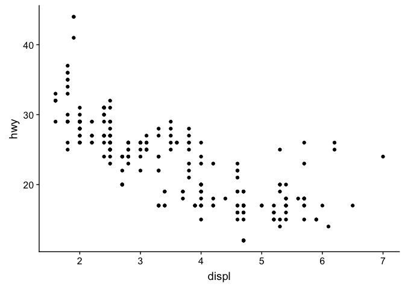

    ## color by factors, default
    ggplot(data = mpg) + 
      geom_point(mapping = aes(x = displ, y = hwy, color = as.factor(cyl)))

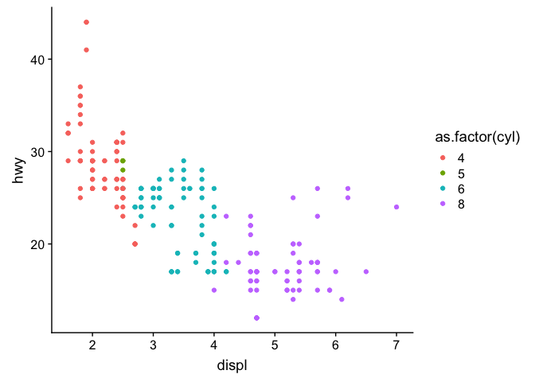

    ggplot(data = mpg) + 
      geom_point(mapping = aes(x = displ, y = hwy, color = as.factor(class)))

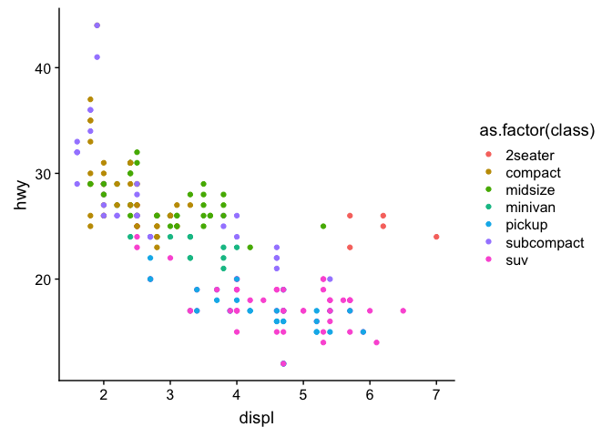

    ## specify order
    levelscyl <- c("4", "5", "6",  "8" )
    levelsclass <- c("2seater", "subcompact", "compact", "midsize",
                     "suv", "minivan", "pickup")
    mpg$cyl <- factor(mpg$cyl, levels = levelscyl)
    mpg$class <- factor(mpg$class, levels = levelsclass)

    ## pick colors using http://colorbrewer2.org/
    colorscyl <- c("4" = "#fdcc8a", 
                   "5" = "#fc8d59", 
                   "6" = "#e34a33",
                   "8" = "#b30000")

    colorsclass <- c("2seater" = "#e41a1c", 
                     "subcompact" = "#1b7837", 
                     "compact" = "#7fbf7b", "midsize" = "#d9f0d3",
                     "suv" = "#d8b365", 
                     "minivan" = "#dfc27d", "pickup" = "#bf812d")

    colorsall <- c(colorscyl, colorsclass)

    ggplot(data = mpg) + 
      geom_point(mapping = aes(x = displ, y = hwy, color = cyl)) +
      scale_color_manual(values = colorsall)

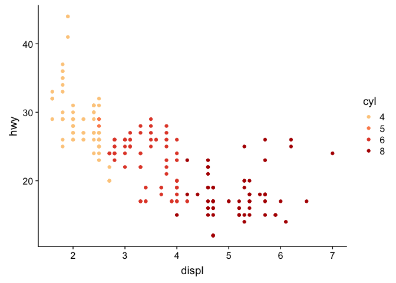

    ggplot(data = mpg) + 
      geom_point(mapping = aes(x = displ, y = hwy, color = class)) +
        scale_color_manual(values = colorsall)

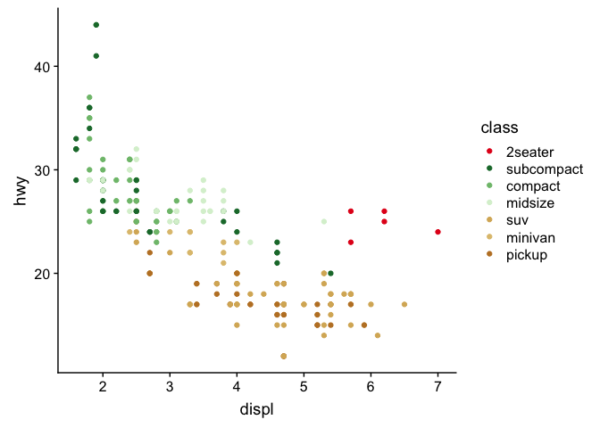

    ## add a custom theme

    mytheme <- function(){
      theme_classic() +
        theme(legend.position = "bottom",
              axis.text.y = element_text(face = "italic"),
              axis.text.x = element_text(angle = 45, hjust = 1))
    }

    a <- ggplot(data = mpg) + 
      geom_point(mapping = aes(x = displ, y = hwy, color = cyl)) +
        scale_color_manual(values = colorsall)  +
      mytheme()  
    a

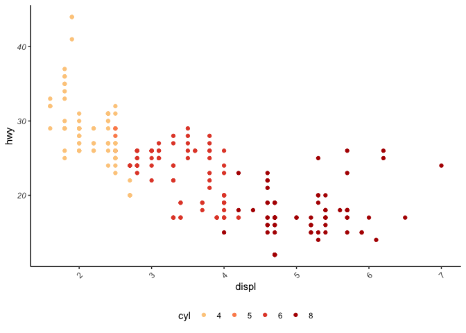

    b <- ggplot(data = mpg) + 
      geom_point(mapping = aes(x = displ, y = hwy, color = class)) +
        scale_color_manual(values = colorsall)  +
      mytheme()
    b

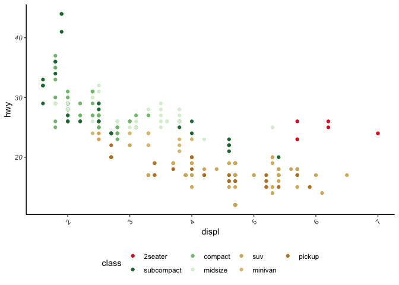

    c <- ggplot(mpg, aes(x = cyl, y = hwy, fill = cyl)) + 
      geom_boxplot(mapping = aes(x = cyl, y = hwy, fill = cyl)) +
        scale_fill_manual(values = colorsall)  +
      mytheme()  
    c

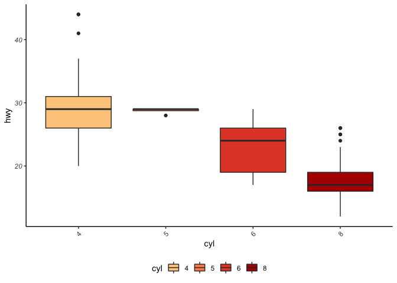

    d <- ggplot(data = mpg) + 
      geom_boxplot(mapping = aes(x = class, y = hwy, fill = class)) +
        scale_fill_manual(values = colorsall)  +
      mytheme()
    d

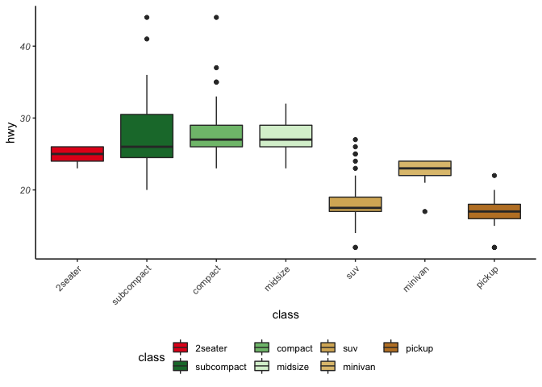

    plot_grid(a,b,c,d)

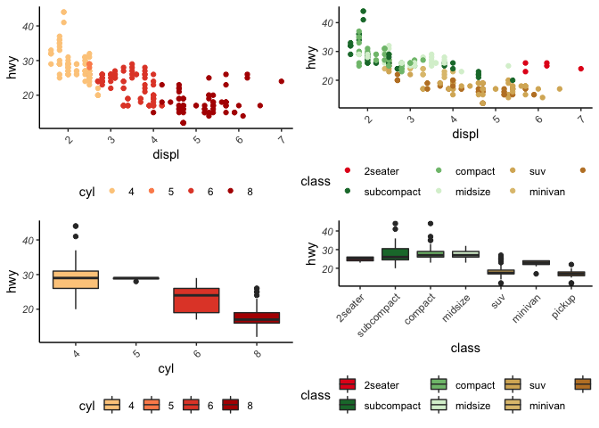

    plot_grid(a,b,
              c + theme(legend.position = "none"),
              d + theme(legend.position = "none"),
              rel_heights = c(0.55,0.45),
              label_size = 12, labels = "auto")

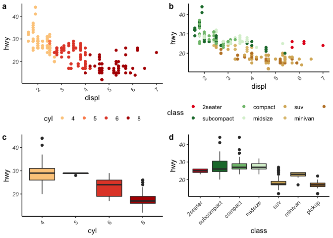
