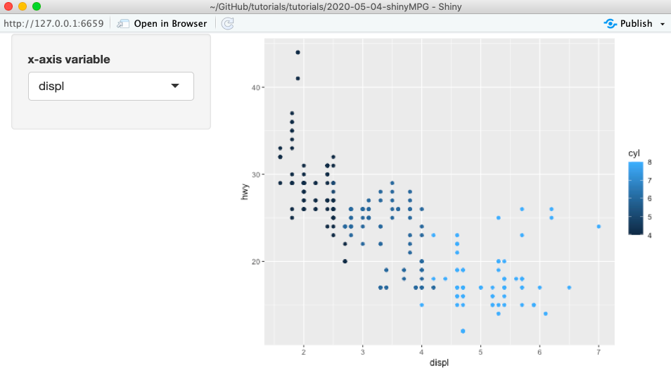

# README

```{r, include=F}

knitr::opts_chunk$set(echo = TRUE, message = F, fig.path = "../images/")

```


## Setup

```{r}
library(tidyverse)
head(mpg)

```


## two plots, copy paste

```{r shinyMPG-1}
mpg %>%
  ggplot(aes(x = displ, y = hwy, color = as.factor(cyl))) + 
  geom_point() 

mpg %>%
  ggplot(aes(x = cty, y = hwy, color = as.factor(cyl))) + 
  geom_point()
```


## two plots, one function

```{r shinyMPG-2}
carplot <- function(xvar){
  mpg %>%
    ggplot(aes(x = xvar, y = hwy, color = as.factor(cyl))) + 
    geom_point() 
}

carplot(mpg$displ)
carplot(mpg$cty)
```


## two plots, one shiny app

See `ui.R` and `server.R`.

