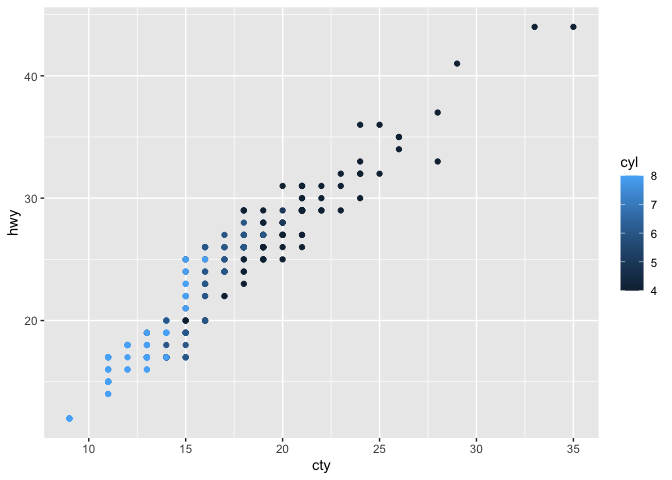

README
======

Setup
-----

    library(tidyverse)
    head(mpg)

    ## # A tibble: 6 x 11
    ##   manufacturer model displ  year   cyl trans  drv     cty   hwy fl    class
    ##   <chr>        <chr> <dbl> <int> <int> <chr>  <chr> <int> <int> <chr> <chr>
    ## 1 audi         a4      1.8  1999     4 auto(… f        18    29 p     comp…
    ## 2 audi         a4      1.8  1999     4 manua… f        21    29 p     comp…
    ## 3 audi         a4      2    2008     4 manua… f        20    31 p     comp…
    ## 4 audi         a4      2    2008     4 auto(… f        21    30 p     comp…
    ## 5 audi         a4      2.8  1999     6 auto(… f        16    26 p     comp…
    ## 6 audi         a4      2.8  1999     6 manua… f        18    26 p     comp…

two plots, copy paste
---------------------

    mpg %>%
      ggplot(aes(x = displ, y = hwy, color = as.factor(cyl))) + 
      geom_point() 

    mpg %>%
      ggplot(aes(x = cty, y = hwy, color = as.factor(cyl))) + 
      geom_point()

two plots, one function
-----------------------

    carplot <- function(xvar){
      mpg %>%
        ggplot(aes(x = xvar, y = hwy, color = as.factor(cyl))) + 
        geom_point() 
    }

    carplot(mpg$displ)

    carplot(mpg$cty)

two plots, one shiny app
------------------------

See `ui.R` and `server.R`.

