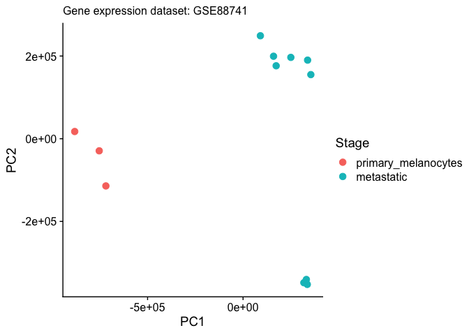

    library(tidyverse)

    ## ── Attaching packages ─────────────────────────────────────── tidyverse 1.3.1 ──

    ## ✓ ggplot2 3.3.5     ✓ purrr   0.3.4
    ## ✓ tibble  3.1.6     ✓ dplyr   1.0.7
    ## ✓ tidyr   1.1.4     ✓ stringr 1.4.0
    ## ✓ readr   2.1.0     ✓ forcats 0.5.1

    ## ── Conflicts ────────────────────────────────────────── tidyverse_conflicts() ──
    ## x dplyr::filter() masks stats::filter()
    ## x dplyr::lag()    masks stats::lag()

    library(ggplot2)
    library(cowplot)
    library(DESeq2)

    ## Loading required package: S4Vectors

    ## Loading required package: stats4

    ## Loading required package: BiocGenerics

    ## Loading required package: parallel

    ## 
    ## Attaching package: 'BiocGenerics'

    ## The following objects are masked from 'package:parallel':
    ## 
    ##     clusterApply, clusterApplyLB, clusterCall, clusterEvalQ,
    ##     clusterExport, clusterMap, parApply, parCapply, parLapply,
    ##     parLapplyLB, parRapply, parSapply, parSapplyLB

    ## The following objects are masked from 'package:dplyr':
    ## 
    ##     combine, intersect, setdiff, union

    ## The following objects are masked from 'package:stats':
    ## 
    ##     IQR, mad, sd, var, xtabs

    ## The following objects are masked from 'package:base':
    ## 
    ##     anyDuplicated, append, as.data.frame, basename, cbind, colnames,
    ##     dirname, do.call, duplicated, eval, evalq, Filter, Find, get, grep,
    ##     grepl, intersect, is.unsorted, lapply, Map, mapply, match, mget,
    ##     order, paste, pmax, pmax.int, pmin, pmin.int, Position, rank,
    ##     rbind, Reduce, rownames, sapply, setdiff, sort, table, tapply,
    ##     union, unique, unsplit, which.max, which.min

    ## 
    ## Attaching package: 'S4Vectors'

    ## The following objects are masked from 'package:dplyr':
    ## 
    ##     first, rename

    ## The following object is masked from 'package:tidyr':
    ## 
    ##     expand

    ## The following objects are masked from 'package:base':
    ## 
    ##     expand.grid, I, unname

    ## Loading required package: IRanges

    ## 
    ## Attaching package: 'IRanges'

    ## The following objects are masked from 'package:dplyr':
    ## 
    ##     collapse, desc, slice

    ## The following object is masked from 'package:purrr':
    ## 
    ##     reduce

    ## Loading required package: GenomicRanges

    ## Loading required package: GenomeInfoDb

    ## Loading required package: SummarizedExperiment

    ## Loading required package: MatrixGenerics

    ## Loading required package: matrixStats

    ## 
    ## Attaching package: 'matrixStats'

    ## The following object is masked from 'package:dplyr':
    ## 
    ##     count

    ## 
    ## Attaching package: 'MatrixGenerics'

    ## The following objects are masked from 'package:matrixStats':
    ## 
    ##     colAlls, colAnyNAs, colAnys, colAvgsPerRowSet, colCollapse,
    ##     colCounts, colCummaxs, colCummins, colCumprods, colCumsums,
    ##     colDiffs, colIQRDiffs, colIQRs, colLogSumExps, colMadDiffs,
    ##     colMads, colMaxs, colMeans2, colMedians, colMins, colOrderStats,
    ##     colProds, colQuantiles, colRanges, colRanks, colSdDiffs, colSds,
    ##     colSums2, colTabulates, colVarDiffs, colVars, colWeightedMads,
    ##     colWeightedMeans, colWeightedMedians, colWeightedSds,
    ##     colWeightedVars, rowAlls, rowAnyNAs, rowAnys, rowAvgsPerColSet,
    ##     rowCollapse, rowCounts, rowCummaxs, rowCummins, rowCumprods,
    ##     rowCumsums, rowDiffs, rowIQRDiffs, rowIQRs, rowLogSumExps,
    ##     rowMadDiffs, rowMads, rowMaxs, rowMeans2, rowMedians, rowMins,
    ##     rowOrderStats, rowProds, rowQuantiles, rowRanges, rowRanks,
    ##     rowSdDiffs, rowSds, rowSums2, rowTabulates, rowVarDiffs, rowVars,
    ##     rowWeightedMads, rowWeightedMeans, rowWeightedMedians,
    ##     rowWeightedSds, rowWeightedVars

    ## Loading required package: Biobase

    ## Welcome to Bioconductor
    ## 
    ##     Vignettes contain introductory material; view with
    ##     'browseVignettes()'. To cite Bioconductor, see
    ##     'citation("Biobase")', and for packages 'citation("pkgname")'.

    ## 
    ## Attaching package: 'Biobase'

    ## The following object is masked from 'package:MatrixGenerics':
    ## 
    ##     rowMedians

    ## The following objects are masked from 'package:matrixStats':
    ## 
    ##     anyMissing, rowMedians

    library(pheatmap)

    ## get data

    ## https://www.ncbi.nlm.nih.gov/geo/query/acc.cgi?acc=GSE88741

    ## https://maayanlab.cloud/biojupies/analyze/example

    countData <- read.delim("GSE88741-expression.txt")
    head(countData)

    ##   gene_symbol GSM2344965 GSM2344966 GSM2344967 GSM2344968 GSM2344969 GSM2344970
    ## 1        A1BG        400        320        490        331        363        390
    ## 2        A1CF          1          1          3          0          0          1
    ## 3         A2M      23278      47606      20484       2652       2707       2854
    ## 4       A2ML1          6          8         10          1          7          4
    ## 5       A2MP1         21          7         34          0          6          3
    ## 6     A3GALT2          0          0          0          1          1          0
    ##   GSM2344971 GSM2344972 GSM2344973 GSM2344974 GSM2344975 GSM2344976
    ## 1        225        248        301        755        391        310
    ## 2          0          2          3          1          0          5
    ## 3          4          7          3      26726      10394      12096
    ## 4          3          0          1          8          4          7
    ## 5          0          0          0         13          3          3
    ## 6          0          0          1          1          6          1

    str(countData)

    ## 'data.frame':    35238 obs. of  13 variables:
    ##  $ gene_symbol: chr  "A1BG" "A1CF" "A2M" "A2ML1" ...
    ##  $ GSM2344965 : int  400 1 23278 6 21 0 0 3 1486 1770 ...
    ##  $ GSM2344966 : int  320 1 47606 8 7 0 0 1 1371 2064 ...
    ##  $ GSM2344967 : int  490 3 20484 10 34 0 25 0 1589 2731 ...
    ##  $ GSM2344968 : int  331 0 2652 1 0 1 121 1 1734 1667 ...
    ##  $ GSM2344969 : int  363 0 2707 7 6 1 123 2 1919 1710 ...
    ##  $ GSM2344970 : int  390 1 2854 4 3 0 171 1 1949 1460 ...
    ##  $ GSM2344971 : int  225 0 4 3 0 0 0 0 1992 2385 ...
    ##  $ GSM2344972 : int  248 2 7 0 0 0 0 0 2119 2134 ...
    ##  $ GSM2344973 : int  301 3 3 1 0 1 2 2 1785 2031 ...
    ##  $ GSM2344974 : int  755 1 26726 8 13 1 52 2 2465 2143 ...
    ##  $ GSM2344975 : int  391 0 10394 4 3 6 22 1 2262 1526 ...
    ##  $ GSM2344976 : int  310 5 12096 7 3 1 25 3 1970 1577 ...

    colData <- read.delim("GSE88741-metadata.txt") %>%
      mutate(cell.type = str_replace(cell.type, " ", "_"),
             Stage = str_replace(Stage, " ", "_")) %>%
      mutate(Stage = factor(Stage, levels = c("primary_melanocytes", 
                                              "metastatic")))
      

    head(colData)

    ##   Sample_geo_accession Sample.Title               Stage          cell.type
    ## 1           GSM2344965         FM_1 primary_melanocytes normal_melanocytes
    ## 2           GSM2344966         FM_2 primary_melanocytes normal_melanocytes
    ## 3           GSM2344967         FM_3 primary_melanocytes normal_melanocytes
    ## 4           GSM2344968  SK_MEL_28_1          metastatic melanoma_cell line
    ## 5           GSM2344969  SK_MEL_28_2          metastatic melanoma_cell line
    ## 6           GSM2344970  SK_MEL_28_3          metastatic melanoma_cell line

    str(colData)

    ## 'data.frame':    12 obs. of  4 variables:
    ##  $ Sample_geo_accession: chr  "GSM2344965" "GSM2344966" "GSM2344967" "GSM2344968" ...
    ##  $ Sample.Title        : chr  "FM_1" "FM_2" "FM_3" "SK_MEL_28_1" ...
    ##  $ Stage               : Factor w/ 2 levels "primary_melanocytes",..: 1 1 1 2 2 2 2 2 2 2 ...
    ##  $ cell.type           : chr  "normal_melanocytes" "normal_melanocytes" "normal_melanocytes" "melanoma_cell line" ...

    ## make joined df for easy ggplot 2 plotting

    df <- countData %>%
      pivot_longer(-gene_symbol, 
                   names_to = "Sample_geo_accession",
                   values_to = "Count") %>%
      full_join(., colData) 

    ## Joining, by = "Sample_geo_accession"

    head(df)

    ## # A tibble: 6 × 6
    ##   gene_symbol Sample_geo_accession Count Sample.Title Stage        cell.type    
    ##   <chr>       <chr>                <int> <chr>        <fct>        <chr>        
    ## 1 A1BG        GSM2344965             400 FM_1         primary_mel… normal_melan…
    ## 2 A1BG        GSM2344966             320 FM_2         primary_mel… normal_melan…
    ## 3 A1BG        GSM2344967             490 FM_3         primary_mel… normal_melan…
    ## 4 A1BG        GSM2344968             331 SK_MEL_28_1  metastatic   melanoma_cel…
    ## 5 A1BG        GSM2344969             363 SK_MEL_28_2  metastatic   melanoma_cel…
    ## 6 A1BG        GSM2344970             390 SK_MEL_28_3  metastatic   melanoma_cel…

    summary(df)

    ##  gene_symbol        Sample_geo_accession     Count          Sample.Title      
    ##  Length:422856      Length:422856        Min.   :     0.0   Length:422856     
    ##  Class :character   Class :character     1st Qu.:     0.0   Class :character  
    ##  Mode  :character   Mode  :character     Median :     3.0   Mode  :character  
    ##                                          Mean   :   960.1                     
    ##                                          3rd Qu.:   498.0                     
    ##                                          Max.   :798530.0                     
    ##                  Stage         cell.type        
    ##  primary_melanocytes:105714   Length:422856     
    ##  metastatic         :317142   Class :character  
    ##                               Mode  :character  
    ##                                                 
    ##                                                 
    ## 

    ## total gene counts 

    totals <- df %>%
      group_by(Sample_geo_accession, Sample.Title, Stage, cell.type) %>%
      summarise(Reads = sum(Count))

    ## `summarise()` has grouped output by 'Sample_geo_accession', 'Sample.Title', 'Stage'. You can override using the `.groups` argument.

    totals

    ## # A tibble: 12 × 5
    ## # Groups:   Sample_geo_accession, Sample.Title, Stage [12]
    ##    Sample_geo_accession Sample.Title Stage               cell.type         Reads
    ##    <chr>                <chr>        <fct>               <chr>             <int>
    ##  1 GSM2344965           FM_1         primary_melanocytes normal_melanoc…  3.10e7
    ##  2 GSM2344966           FM_2         primary_melanocytes normal_melanoc…  3.14e7
    ##  3 GSM2344967           FM_3         primary_melanocytes normal_melanoc…  3.12e7
    ##  4 GSM2344968           SK_MEL_28_1  metastatic          melanoma_cell …  3.19e7
    ##  5 GSM2344969           SK_MEL_28_2  metastatic          melanoma_cell …  3.52e7
    ##  6 GSM2344970           SK_MEL_28_3  metastatic          melanoma_cell …  3.48e7
    ##  7 GSM2344971           SK_MEL_147_1 metastatic          melanoma_cell …  3.66e7
    ##  8 GSM2344972           SK_MEL_147_2 metastatic          melanoma_cell …  3.55e7
    ##  9 GSM2344973           SK_MEL_147_3 metastatic          melanoma_cell …  3.39e7
    ## 10 GSM2344974           UACC_62_1    metastatic          melanoma_cell …  3.39e7
    ## 11 GSM2344975           UACC_62_2    metastatic          melanoma_cell …  3.63e7
    ## 12 GSM2344976           UACC_62_3    metastatic          melanoma_cell …  3.42e7

    totals %>%
      ggplot(aes(x = reorder(Sample_geo_accession, Reads),
                 y = Reads)) +
      geom_bar(stat = "identity", fill = "#2877b2") +
      scale_y_continuous(labels = scales::label_number_si()) +
      coord_flip() +
      labs(x = "Sample",
           subtitle = "Gene expression dataset: GSE88741")

    totals %>%
      ggplot(aes(x = reorder(Sample_geo_accession, Reads),
                 y = Reads)) +
      geom_bar(stat = "identity", aes(fill = Stage)) +
      scale_y_continuous(labels = scales::label_number_si()) +
      coord_flip() +
      labs(x = "Sample", fill = "Stage",
           subtitle = "Gene expression dataset: GSE88741")

    ## prep for DESeq2 and PCA

    rownames(colData) <- colData$Sample_geo_accession
    rownames(countData) <- countData$gene_symbol
    countData$gene_symbol <- NULL

    ## for pca
    df_pca <- as.data.frame(t(countData)) %>%
      prcomp()
    df_pca <- as.data.frame(df_pca$x)

    df_pca <- df_pca %>%
      mutate(Sample_geo_accession = row.names(.)) %>%
      full_join(., colData)

    ## Joining, by = "Sample_geo_accession"

    head(df_pca)

    ##          PC1        PC2         PC3        PC4        PC5        PC6        PC7
    ## 1 -881588.63   17465.50   83889.262 -204423.47  110867.92   5230.522  -7821.427
    ## 2 -718463.93 -114174.70   32387.638  314402.78   22236.92  27516.532  25595.212
    ## 3 -753222.79  -29246.42    5413.795  -67620.29 -143375.97 -43268.935 -23379.141
    ## 4  173325.28  176419.29 -254081.604   42631.58   17947.37  18843.382 -19669.319
    ## 5  159639.89  199536.18 -270429.988   31069.74   12945.93 -19895.686   2281.541
    ## 6   90781.26  249069.84 -288620.959  -55715.11  -13723.39   9424.533  20362.364
    ##          PC8        PC9        PC10         PC11          PC12
    ## 1   4250.710  -4098.340    478.9150   -362.38763 -2.001735e-08
    ## 2   4582.882   6968.686  -1197.4381     21.71287 -6.250906e-09
    ## 3 -10175.788  -3741.078    943.7054    272.98437  2.072137e-08
    ## 4 -40748.298 -31238.024 -12008.0515 -13210.88423  6.787353e-09
    ## 5  13397.240 -14174.963  25490.0839  16922.46043  6.715481e-09
    ## 6  27025.683  39576.865 -13449.7920  -4379.59777  5.112602e-09
    ##   Sample_geo_accession Sample.Title               Stage          cell.type
    ## 1           GSM2344965         FM_1 primary_melanocytes normal_melanocytes
    ## 2           GSM2344966         FM_2 primary_melanocytes normal_melanocytes
    ## 3           GSM2344967         FM_3 primary_melanocytes normal_melanocytes
    ## 4           GSM2344968  SK_MEL_28_1          metastatic melanoma_cell line
    ## 5           GSM2344969  SK_MEL_28_2          metastatic melanoma_cell line
    ## 6           GSM2344970  SK_MEL_28_3          metastatic melanoma_cell line

    df_pca %>%
      ggplot(aes(x = PC1, y = PC2)) +
      geom_point(aes(color = Stage), size = 3) +
      theme_cowplot() +
      labs(color = "Stage",
           subtitle = "Gene expression dataset: GSE88741")

    ## deseq2

    dds <- DESeqDataSetFromMatrix(countData = countData,
                                  colData = colData,
                                  design= ~ Stage)
    dds <- DESeq(dds)

    ## estimating size factors

    ## estimating dispersions

    ## gene-wise dispersion estimates

    ## mean-dispersion relationship

    ## final dispersion estimates

    ## fitting model and testing

    ## -- replacing outliers and refitting for 130 genes
    ## -- DESeq argument 'minReplicatesForReplace' = 7 
    ## -- original counts are preserved in counts(dds)

    ## estimating dispersions

    ## fitting model and testing

    resultsNames(dds) # lists the coefficients

    ## [1] "Intercept"                              
    ## [2] "Stage_metastatic_vs_primary_melanocytes"

    res <- results(dds)

    res

    ## log2 fold change (MLE): Stage metastatic vs primary melanocytes 
    ## Wald test p-value: Stage metastatic vs primary melanocytes 
    ## DataFrame with 35238 rows and 6 columns
    ##                 baseMean log2FoldChange     lfcSE      stat      pvalue
    ##                <numeric>      <numeric> <numeric> <numeric>   <numeric>
    ## A1BG           374.69791      -0.334377  0.349967 -0.955452   0.3393494
    ## A1CF             1.40349      -0.528494  1.328288 -0.397876   0.6907218
    ## A2M          12905.70862      -2.481465  1.592500 -1.558220   0.1191811
    ## A2ML1            4.96439      -1.249957  0.733151 -1.704912   0.0882108
    ## A2MP1            7.87043      -2.944292  1.230338 -2.393076   0.0167078
    ## ...                  ...            ...       ...       ...         ...
    ## BP-2171C21.4    0.679675       0.984127  3.227060 0.3049609 7.60396e-01
    ## BP-2171C21.5    0.161844       0.435107  3.598641 0.1209088 9.03763e-01
    ## BP-2171C21.6   14.056028       1.973514  0.805320 2.4505961 1.42620e-02
    ## BP-2189O9.2    49.889978       4.307869  0.636548 6.7675503 1.30981e-11
    ## YR211F11.2      0.403001       0.114530  2.413557 0.0474528 9.62152e-01
    ##                     padj
    ##                <numeric>
    ## A1BG           0.5045967
    ## A1CF           0.8058617
    ## A2M            0.2405783
    ## A2ML1          0.1916004
    ## A2MP1          0.0527418
    ## ...                  ...
    ## BP-2171C21.4          NA
    ## BP-2171C21.5          NA
    ## BP-2171C21.6 4.63791e-02
    ## BP-2189O9.2  4.14358e-10
    ## YR211F11.2            NA

    summary(res)

    ## 
    ## out of 26859 with nonzero total read count
    ## adjusted p-value < 0.1
    ## LFC > 0 (up)       : 4567, 17%
    ## LFC < 0 (down)     : 3172, 12%
    ## outliers [1]       : 87, 0.32%
    ## low counts [2]     : 6157, 23%
    ## (mean count < 1)
    ## [1] see 'cooksCutoff' argument of ?results
    ## [2] see 'independentFiltering' argument of ?results

    resOrdered <- res[order(res$pvalue),]
    resOrdered

    ## log2 fold change (MLE): Stage metastatic vs primary melanocytes 
    ## Wald test p-value: Stage metastatic vs primary melanocytes 
    ## DataFrame with 35238 rows and 6 columns
    ##              baseMean log2FoldChange     lfcSE      stat       pvalue
    ##             <numeric>      <numeric> <numeric> <numeric>    <numeric>
    ## AEBP1        4885.366      -13.16962  0.486278  -27.0825 1.58339e-161
    ## CA14         1799.913       -7.19154  0.272314  -26.4090 1.08056e-153
    ## NFATC4        814.325       -9.64938  0.373190  -25.8565 2.05861e-147
    ## THNSL2        347.852       -8.20635  0.347031  -23.6473 1.25825e-123
    ## DDX3Y         611.395       -9.67088  0.426186  -22.6917 5.40834e-114
    ## ...               ...            ...       ...       ...          ...
    ## ZNRF4               0             NA        NA        NA           NA
    ## ZPBP                0             NA        NA        NA           NA
    ## ZSWIM5P3            0             NA        NA        NA           NA
    ## ZYXP1               0             NA        NA        NA           NA
    ## BP-2168N6.3         0             NA        NA        NA           NA
    ##                     padj
    ##                <numeric>
    ## AEBP1       3.26589e-157
    ## CA14        1.11438e-149
    ## NFATC4      1.41536e-143
    ## THNSL2      6.48817e-120
    ## DDX3Y       2.23105e-110
    ## ...                  ...
    ## ZNRF4                 NA
    ## ZPBP                  NA
    ## ZSWIM5P3              NA
    ## ZYXP1                 NA
    ## BP-2168N6.3           NA

    # DEGs
    sum(res$padj < 0.1, na.rm=TRUE)

    ## [1] 7739

    plotMA(res, ylim=c(-2,2))

    ## heatmap
    select <- order(rowMeans(counts(dds,normalized=TRUE)),
                    decreasing=TRUE)[1:25]
    anndf <- as.data.frame(colData(dds)[,c("Sample_geo_accession","Stage")])
    ntd <- normTransform(dds)
    pheatmap(assay(ntd)[select,], 
             cluster_rows=T, show_rownames=TRUE,
             cluster_cols=T, annotation_col = anndf)

    ## top 5 degs

    df %>%
      filter(gene_symbol %in% c("AEBP1", "CA14", "NFATC4",   "PMEL", "SERPINE2")) %>%
      ggplot(aes(x = Stage, y = Count)) +
      geom_point() +
      geom_boxplot(aes(fill = Stage)) +
      facet_wrap(~gene_symbol, nrow =1, scales = "free_y") +
      theme_cowplot() +
      theme(legend.position = "none",
            axis.text.x = element_text(angle = 90, hjust = 1, vjust = 0.5),
            strip.text = element_text(face = "italic"))  +
      scale_y_continuous(labels = scales::label_number_si()) +
      labs(subtitle = "Differentially expressed genes from GSE88741")

    df %>%
      filter(gene_symbol %in% c("BRCA1", "POMC", "PRL",   "PRLR", "MC2R", "FOS", "JUN")) %>%
      ggplot(aes(x = Stage, y = Count)) +
      geom_point() +
      geom_boxplot(aes(fill = Stage)) +
      facet_wrap(~gene_symbol, nrow =1, scales = "free_y") +
      theme_cowplot() +
      theme(legend.position = "none",
            axis.text.x = element_text(angle = 90, hjust = 1, vjust = 0.5),
            strip.text = element_text(face = "italic"))  +
      scale_y_continuous(labels = scales::label_number_si()) +
      labs(subtitle =  "Favorite genes")

