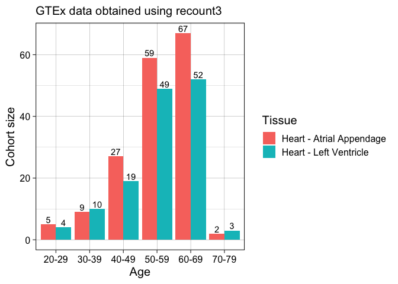
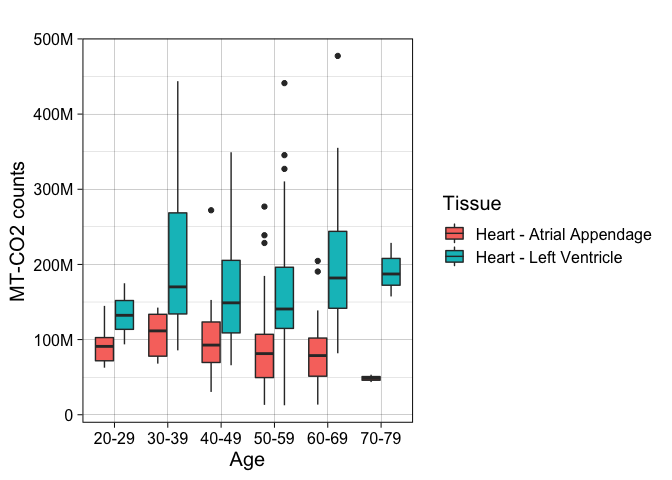
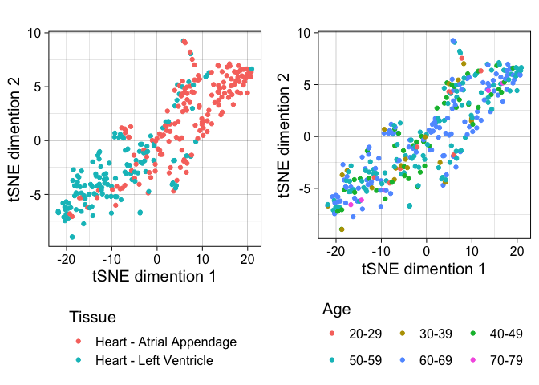
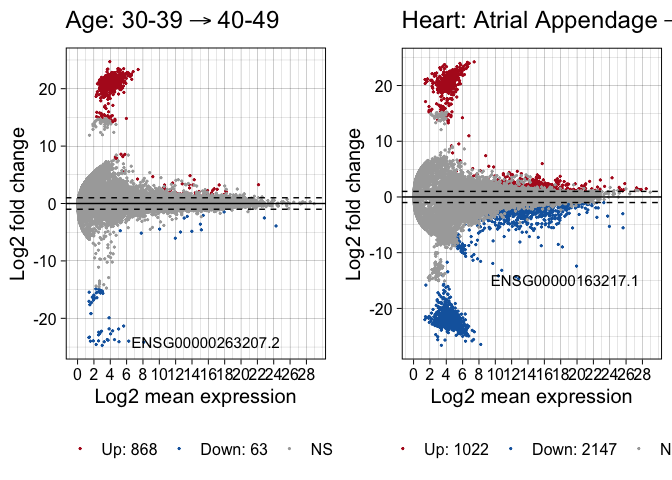

    library(tidyverse)

    ## ── Attaching packages ─────────────────────────────────────── tidyverse 1.3.1 ──

    ## ✓ ggplot2 3.3.5     ✓ purrr   0.3.4
    ## ✓ tibble  3.1.6     ✓ dplyr   1.0.7
    ## ✓ tidyr   1.1.4     ✓ stringr 1.4.0
    ## ✓ readr   2.1.1     ✓ forcats 0.5.1

    ## ── Conflicts ────────────────────────────────────────── tidyverse_conflicts() ──
    ## x dplyr::filter() masks stats::filter()
    ## x dplyr::lag()    masks stats::lag()

    library(recount3)

    ## Loading required package: SummarizedExperiment

    ## Loading required package: MatrixGenerics

    ## Loading required package: matrixStats

    ## 
    ## Attaching package: 'matrixStats'

    ## The following object is masked from 'package:dplyr':
    ## 
    ##     count

    ## 
    ## Attaching package: 'MatrixGenerics'

    ## The following objects are masked from 'package:matrixStats':
    ## 
    ##     colAlls, colAnyNAs, colAnys, colAvgsPerRowSet, colCollapse,
    ##     colCounts, colCummaxs, colCummins, colCumprods, colCumsums,
    ##     colDiffs, colIQRDiffs, colIQRs, colLogSumExps, colMadDiffs,
    ##     colMads, colMaxs, colMeans2, colMedians, colMins, colOrderStats,
    ##     colProds, colQuantiles, colRanges, colRanks, colSdDiffs, colSds,
    ##     colSums2, colTabulates, colVarDiffs, colVars, colWeightedMads,
    ##     colWeightedMeans, colWeightedMedians, colWeightedSds,
    ##     colWeightedVars, rowAlls, rowAnyNAs, rowAnys, rowAvgsPerColSet,
    ##     rowCollapse, rowCounts, rowCummaxs, rowCummins, rowCumprods,
    ##     rowCumsums, rowDiffs, rowIQRDiffs, rowIQRs, rowLogSumExps,
    ##     rowMadDiffs, rowMads, rowMaxs, rowMeans2, rowMedians, rowMins,
    ##     rowOrderStats, rowProds, rowQuantiles, rowRanges, rowRanks,
    ##     rowSdDiffs, rowSds, rowSums2, rowTabulates, rowVarDiffs, rowVars,
    ##     rowWeightedMads, rowWeightedMeans, rowWeightedMedians,
    ##     rowWeightedSds, rowWeightedVars

    ## Loading required package: GenomicRanges

    ## Loading required package: stats4

    ## Loading required package: BiocGenerics

    ## Loading required package: parallel

    ## 
    ## Attaching package: 'BiocGenerics'

    ## The following objects are masked from 'package:parallel':
    ## 
    ##     clusterApply, clusterApplyLB, clusterCall, clusterEvalQ,
    ##     clusterExport, clusterMap, parApply, parCapply, parLapply,
    ##     parLapplyLB, parRapply, parSapply, parSapplyLB

    ## The following objects are masked from 'package:dplyr':
    ## 
    ##     combine, intersect, setdiff, union

    ## The following objects are masked from 'package:stats':
    ## 
    ##     IQR, mad, sd, var, xtabs

    ## The following objects are masked from 'package:base':
    ## 
    ##     anyDuplicated, append, as.data.frame, basename, cbind, colnames,
    ##     dirname, do.call, duplicated, eval, evalq, Filter, Find, get, grep,
    ##     grepl, intersect, is.unsorted, lapply, Map, mapply, match, mget,
    ##     order, paste, pmax, pmax.int, pmin, pmin.int, Position, rank,
    ##     rbind, Reduce, rownames, sapply, setdiff, sort, table, tapply,
    ##     union, unique, unsplit, which.max, which.min

    ## Loading required package: S4Vectors

    ## 
    ## Attaching package: 'S4Vectors'

    ## The following objects are masked from 'package:dplyr':
    ## 
    ##     first, rename

    ## The following object is masked from 'package:tidyr':
    ## 
    ##     expand

    ## The following objects are masked from 'package:base':
    ## 
    ##     expand.grid, I, unname

    ## Loading required package: IRanges

    ## 
    ## Attaching package: 'IRanges'

    ## The following objects are masked from 'package:dplyr':
    ## 
    ##     collapse, desc, slice

    ## The following object is masked from 'package:purrr':
    ## 
    ##     reduce

    ## Loading required package: GenomeInfoDb

    ## Loading required package: Biobase

    ## Welcome to Bioconductor
    ## 
    ##     Vignettes contain introductory material; view with
    ##     'browseVignettes()'. To cite Bioconductor, see
    ##     'citation("Biobase")', and for packages 'citation("pkgname")'.

    ## 
    ## Attaching package: 'Biobase'

    ## The following object is masked from 'package:MatrixGenerics':
    ## 
    ##     rowMedians

    ## The following objects are masked from 'package:matrixStats':
    ## 
    ##     anyMissing, rowMedians

    library(biomaRt)
    library(Rtsne)
    library(cowplot)
    library(DESeq2)
    library(ggpubr)

    ## 
    ## Attaching package: 'ggpubr'

    ## The following object is masked from 'package:cowplot':
    ## 
    ##     get_legend

    # From https://bioconductor.org/packages/release/bioc/vignettes/recount3/inst/doc/recount3-quickstart.html

    # get GTEx heart data
    human_projects <- available_projects(organism = "human")

    ## 2022-01-11 11:37:37 caching file sra.recount_project.MD.gz.

    ## 2022-01-11 11:37:40 caching file gtex.recount_project.MD.gz.

    ## 2022-01-11 11:37:41 caching file tcga.recount_project.MD.gz.

    head(human_projects)

    ##     project organism file_source     project_home project_type n_samples
    ## 1 SRP107565    human         sra data_sources/sra data_sources       216
    ## 2 SRP149665    human         sra data_sources/sra data_sources         4
    ## 3 SRP017465    human         sra data_sources/sra data_sources        23
    ## 4 SRP119165    human         sra data_sources/sra data_sources         6
    ## 5 SRP133965    human         sra data_sources/sra data_sources        12
    ## 6 SRP096765    human         sra data_sources/sra data_sources         7

    gtex_heart <- subset(human_projects,
                         project == "HEART"  & 
                           file_source == "gtex" & 
                           project_type == "data_sources" )

    head(gtex_heart)

    ##      project organism file_source      project_home project_type n_samples
    ## 8681   HEART    human        gtex data_sources/gtex data_sources       942

    rse_gtex_heart <- create_rse(gtex_heart)

    ## 2022-01-11 11:37:49 downloading and reading the metadata.

    ## 2022-01-11 11:37:50 caching file gtex.gtex.HEART.MD.gz.

    ## 2022-01-11 11:37:51 caching file gtex.recount_project.HEART.MD.gz.

    ## 2022-01-11 11:37:53 caching file gtex.recount_qc.HEART.MD.gz.

    ## 2022-01-11 11:37:54 caching file gtex.recount_seq_qc.HEART.MD.gz.

    ## 2022-01-11 11:37:56 downloading and reading the feature information.

    ## 2022-01-11 11:37:57 caching file human.gene_sums.G026.gtf.gz.

    ## 2022-01-11 11:37:59 downloading and reading the counts: 942 samples across 63856 features.

    ## 2022-01-11 11:38:00 caching file gtex.gene_sums.HEART.G026.gz.

    ## 2022-01-11 11:38:15 construcing the RangedSummarizedExperiment (rse) object.

    rse_gtex_heart

    ## class: RangedSummarizedExperiment 
    ## dim: 63856 942 
    ## metadata(8): time_created recount3_version ... annotation recount3_url
    ## assays(1): raw_counts
    ## rownames(63856): ENSG00000278704.1 ENSG00000277400.1 ...
    ##   ENSG00000182484.15_PAR_Y ENSG00000227159.8_PAR_Y
    ## rowData names(10): source type ... havana_gene tag
    ## colnames(942): GTEX-X261-0926-SM-3NMCY.1 GTEX-X4XX-1126-SM-3NMBY.1 ...
    ##   GTEX-1L5NE-0426-SM-E9TIX.1 GTEX-1NV8Z-1526-SM-DTX8X.1
    ## colData names(198): rail_id external_id ... recount_seq_qc.errq
    ##   BigWigURL

    # format data for DESEq2
    countData <- assays(rse_gtex_heart)$raw_counts %>% 
      as.data.frame()
    colData <- colData(rse_gtex_heart) %>% as.data.frame()

    # check that rows and samples match
    rownames(colData) == colnames(countData)

    ##   [1] TRUE TRUE TRUE TRUE TRUE TRUE TRUE TRUE TRUE TRUE TRUE TRUE TRUE TRUE TRUE
    ##  [16] TRUE TRUE TRUE TRUE TRUE TRUE TRUE TRUE TRUE TRUE TRUE TRUE TRUE TRUE TRUE
    ##  [31] TRUE TRUE TRUE TRUE TRUE TRUE TRUE TRUE TRUE TRUE TRUE TRUE TRUE TRUE TRUE
    ##  [46] TRUE TRUE TRUE TRUE TRUE TRUE TRUE TRUE TRUE TRUE TRUE TRUE TRUE TRUE TRUE
    ##  [61] TRUE TRUE TRUE TRUE TRUE TRUE TRUE TRUE TRUE TRUE TRUE TRUE TRUE TRUE TRUE
    ##  [76] TRUE TRUE TRUE TRUE TRUE TRUE TRUE TRUE TRUE TRUE TRUE TRUE TRUE TRUE TRUE
    ##  [91] TRUE TRUE TRUE TRUE TRUE TRUE TRUE TRUE TRUE TRUE TRUE TRUE TRUE TRUE TRUE
    ## [106] TRUE TRUE TRUE TRUE TRUE TRUE TRUE TRUE TRUE TRUE TRUE TRUE TRUE TRUE TRUE
    ## [121] TRUE TRUE TRUE TRUE TRUE TRUE TRUE TRUE TRUE TRUE TRUE TRUE TRUE TRUE TRUE
    ## [136] TRUE TRUE TRUE TRUE TRUE TRUE TRUE TRUE TRUE TRUE TRUE TRUE TRUE TRUE TRUE
    ## [151] TRUE TRUE TRUE TRUE TRUE TRUE TRUE TRUE TRUE TRUE TRUE TRUE TRUE TRUE TRUE
    ## [166] TRUE TRUE TRUE TRUE TRUE TRUE TRUE TRUE TRUE TRUE TRUE TRUE TRUE TRUE TRUE
    ## [181] TRUE TRUE TRUE TRUE TRUE TRUE TRUE TRUE TRUE TRUE TRUE TRUE TRUE TRUE TRUE
    ## [196] TRUE TRUE TRUE TRUE TRUE TRUE TRUE TRUE TRUE TRUE TRUE TRUE TRUE TRUE TRUE
    ## [211] TRUE TRUE TRUE TRUE TRUE TRUE TRUE TRUE TRUE TRUE TRUE TRUE TRUE TRUE TRUE
    ## [226] TRUE TRUE TRUE TRUE TRUE TRUE TRUE TRUE TRUE TRUE TRUE TRUE TRUE TRUE TRUE
    ## [241] TRUE TRUE TRUE TRUE TRUE TRUE TRUE TRUE TRUE TRUE TRUE TRUE TRUE TRUE TRUE
    ## [256] TRUE TRUE TRUE TRUE TRUE TRUE TRUE TRUE TRUE TRUE TRUE TRUE TRUE TRUE TRUE
    ## [271] TRUE TRUE TRUE TRUE TRUE TRUE TRUE TRUE TRUE TRUE TRUE TRUE TRUE TRUE TRUE
    ## [286] TRUE TRUE TRUE TRUE TRUE TRUE TRUE TRUE TRUE TRUE TRUE TRUE TRUE TRUE TRUE
    ## [301] TRUE TRUE TRUE TRUE TRUE TRUE TRUE TRUE TRUE TRUE TRUE TRUE TRUE TRUE TRUE
    ## [316] TRUE TRUE TRUE TRUE TRUE TRUE TRUE TRUE TRUE TRUE TRUE TRUE TRUE TRUE TRUE
    ## [331] TRUE TRUE TRUE TRUE TRUE TRUE TRUE TRUE TRUE TRUE TRUE TRUE TRUE TRUE TRUE
    ## [346] TRUE TRUE TRUE TRUE TRUE TRUE TRUE TRUE TRUE TRUE TRUE TRUE TRUE TRUE TRUE
    ## [361] TRUE TRUE TRUE TRUE TRUE TRUE TRUE TRUE TRUE TRUE TRUE TRUE TRUE TRUE TRUE
    ## [376] TRUE TRUE TRUE TRUE TRUE TRUE TRUE TRUE TRUE TRUE TRUE TRUE TRUE TRUE TRUE
    ## [391] TRUE TRUE TRUE TRUE TRUE TRUE TRUE TRUE TRUE TRUE TRUE TRUE TRUE TRUE TRUE
    ## [406] TRUE TRUE TRUE TRUE TRUE TRUE TRUE TRUE TRUE TRUE TRUE TRUE TRUE TRUE TRUE
    ## [421] TRUE TRUE TRUE TRUE TRUE TRUE TRUE TRUE TRUE TRUE TRUE TRUE TRUE TRUE TRUE
    ## [436] TRUE TRUE TRUE TRUE TRUE TRUE TRUE TRUE TRUE TRUE TRUE TRUE TRUE TRUE TRUE
    ## [451] TRUE TRUE TRUE TRUE TRUE TRUE TRUE TRUE TRUE TRUE TRUE TRUE TRUE TRUE TRUE
    ## [466] TRUE TRUE TRUE TRUE TRUE TRUE TRUE TRUE TRUE TRUE TRUE TRUE TRUE TRUE TRUE
    ## [481] TRUE TRUE TRUE TRUE TRUE TRUE TRUE TRUE TRUE TRUE TRUE TRUE TRUE TRUE TRUE
    ## [496] TRUE TRUE TRUE TRUE TRUE TRUE TRUE TRUE TRUE TRUE TRUE TRUE TRUE TRUE TRUE
    ## [511] TRUE TRUE TRUE TRUE TRUE TRUE TRUE TRUE TRUE TRUE TRUE TRUE TRUE TRUE TRUE
    ## [526] TRUE TRUE TRUE TRUE TRUE TRUE TRUE TRUE TRUE TRUE TRUE TRUE TRUE TRUE TRUE
    ## [541] TRUE TRUE TRUE TRUE TRUE TRUE TRUE TRUE TRUE TRUE TRUE TRUE TRUE TRUE TRUE
    ## [556] TRUE TRUE TRUE TRUE TRUE TRUE TRUE TRUE TRUE TRUE TRUE TRUE TRUE TRUE TRUE
    ## [571] TRUE TRUE TRUE TRUE TRUE TRUE TRUE TRUE TRUE TRUE TRUE TRUE TRUE TRUE TRUE
    ## [586] TRUE TRUE TRUE TRUE TRUE TRUE TRUE TRUE TRUE TRUE TRUE TRUE TRUE TRUE TRUE
    ## [601] TRUE TRUE TRUE TRUE TRUE TRUE TRUE TRUE TRUE TRUE TRUE TRUE TRUE TRUE TRUE
    ## [616] TRUE TRUE TRUE TRUE TRUE TRUE TRUE TRUE TRUE TRUE TRUE TRUE TRUE TRUE TRUE
    ## [631] TRUE TRUE TRUE TRUE TRUE TRUE TRUE TRUE TRUE TRUE TRUE TRUE TRUE TRUE TRUE
    ## [646] TRUE TRUE TRUE TRUE TRUE TRUE TRUE TRUE TRUE TRUE TRUE TRUE TRUE TRUE TRUE
    ## [661] TRUE TRUE TRUE TRUE TRUE TRUE TRUE TRUE TRUE TRUE TRUE TRUE TRUE TRUE TRUE
    ## [676] TRUE TRUE TRUE TRUE TRUE TRUE TRUE TRUE TRUE TRUE TRUE TRUE TRUE TRUE TRUE
    ## [691] TRUE TRUE TRUE TRUE TRUE TRUE TRUE TRUE TRUE TRUE TRUE TRUE TRUE TRUE TRUE
    ## [706] TRUE TRUE TRUE TRUE TRUE TRUE TRUE TRUE TRUE TRUE TRUE TRUE TRUE TRUE TRUE
    ## [721] TRUE TRUE TRUE TRUE TRUE TRUE TRUE TRUE TRUE TRUE TRUE TRUE TRUE TRUE TRUE
    ## [736] TRUE TRUE TRUE TRUE TRUE TRUE TRUE TRUE TRUE TRUE TRUE TRUE TRUE TRUE TRUE
    ## [751] TRUE TRUE TRUE TRUE TRUE TRUE TRUE TRUE TRUE TRUE TRUE TRUE TRUE TRUE TRUE
    ## [766] TRUE TRUE TRUE TRUE TRUE TRUE TRUE TRUE TRUE TRUE TRUE TRUE TRUE TRUE TRUE
    ## [781] TRUE TRUE TRUE TRUE TRUE TRUE TRUE TRUE TRUE TRUE TRUE TRUE TRUE TRUE TRUE
    ## [796] TRUE TRUE TRUE TRUE TRUE TRUE TRUE TRUE TRUE TRUE TRUE TRUE TRUE TRUE TRUE
    ## [811] TRUE TRUE TRUE TRUE TRUE TRUE TRUE TRUE TRUE TRUE TRUE TRUE TRUE TRUE TRUE
    ## [826] TRUE TRUE TRUE TRUE TRUE TRUE TRUE TRUE TRUE TRUE TRUE TRUE TRUE TRUE TRUE
    ## [841] TRUE TRUE TRUE TRUE TRUE TRUE TRUE TRUE TRUE TRUE TRUE TRUE TRUE TRUE TRUE
    ## [856] TRUE TRUE TRUE TRUE TRUE TRUE TRUE TRUE TRUE TRUE TRUE TRUE TRUE TRUE TRUE
    ## [871] TRUE TRUE TRUE TRUE TRUE TRUE TRUE TRUE TRUE TRUE TRUE TRUE TRUE TRUE TRUE
    ## [886] TRUE TRUE TRUE TRUE TRUE TRUE TRUE TRUE TRUE TRUE TRUE TRUE TRUE TRUE TRUE
    ## [901] TRUE TRUE TRUE TRUE TRUE TRUE TRUE TRUE TRUE TRUE TRUE TRUE TRUE TRUE TRUE
    ## [916] TRUE TRUE TRUE TRUE TRUE TRUE TRUE TRUE TRUE TRUE TRUE TRUE TRUE TRUE TRUE
    ## [931] TRUE TRUE TRUE TRUE TRUE TRUE TRUE TRUE TRUE TRUE TRUE TRUE

    # variables
    dim(colData)

    ## [1] 942 198

    dim(countData)

    ## [1] 63856   942

    head(rownames(colData))

    ## [1] "GTEX-X261-0926-SM-3NMCY.1"  "GTEX-X4XX-1126-SM-3NMBY.1" 
    ## [3] "GTEX-131XF-5001-SM-7DHLY.1" "GTEX-14A6H-5006-SM-7EWE9.1"
    ## [5] "GTEX-14E1K-0826-SM-5ZZW9.1" "GTEX-14JG1-1026-SM-6ETZY.1"

    (colnames(colData))

    ##   [1] "rail_id"                                                           
    ##   [2] "external_id"                                                       
    ##   [3] "study"                                                             
    ##   [4] "gtex.run_acc"                                                      
    ##   [5] "gtex.subjid"                                                       
    ##   [6] "gtex.sex"                                                          
    ##   [7] "gtex.age"                                                          
    ##   [8] "gtex.dthhrdy"                                                      
    ##   [9] "gtex.sampid"                                                       
    ##  [10] "gtex.smatsscr"                                                     
    ##  [11] "gtex.smcenter"                                                     
    ##  [12] "gtex.smpthnts"                                                     
    ##  [13] "gtex.smrin"                                                        
    ##  [14] "gtex.smts"                                                         
    ##  [15] "gtex.smtsd"                                                        
    ##  [16] "gtex.smubrid"                                                      
    ##  [17] "gtex.smtsisch"                                                     
    ##  [18] "gtex.smtspax"                                                      
    ##  [19] "gtex.smnabtch"                                                     
    ##  [20] "gtex.smnabtcht"                                                    
    ##  [21] "gtex.smnabtchd"                                                    
    ##  [22] "gtex.smgebtch"                                                     
    ##  [23] "gtex.smgebtchd"                                                    
    ##  [24] "gtex.smgebtcht"                                                    
    ##  [25] "gtex.smafrze"                                                      
    ##  [26] "gtex.smgtc"                                                        
    ##  [27] "gtex.sme2mprt"                                                     
    ##  [28] "gtex.smchmprs"                                                     
    ##  [29] "gtex.smntrart"                                                     
    ##  [30] "gtex.smnumgps"                                                     
    ##  [31] "gtex.smmaprt"                                                      
    ##  [32] "gtex.smexncrt"                                                     
    ##  [33] "gtex.sm550nrm"                                                     
    ##  [34] "gtex.smgnsdtc"                                                     
    ##  [35] "gtex.smunmprt"                                                     
    ##  [36] "gtex.sm350nrm"                                                     
    ##  [37] "gtex.smrdlgth"                                                     
    ##  [38] "gtex.smmncpb"                                                      
    ##  [39] "gtex.sme1mmrt"                                                     
    ##  [40] "gtex.smsflgth"                                                     
    ##  [41] "gtex.smestlbs"                                                     
    ##  [42] "gtex.smmppd"                                                       
    ##  [43] "gtex.smnterrt"                                                     
    ##  [44] "gtex.smrrnanm"                                                     
    ##  [45] "gtex.smrdttl"                                                      
    ##  [46] "gtex.smvqcfl"                                                      
    ##  [47] "gtex.smmncv"                                                       
    ##  [48] "gtex.smtrscpt"                                                     
    ##  [49] "gtex.smmppdpr"                                                     
    ##  [50] "gtex.smcglgth"                                                     
    ##  [51] "gtex.smgappct"                                                     
    ##  [52] "gtex.smunpdrd"                                                     
    ##  [53] "gtex.smntrnrt"                                                     
    ##  [54] "gtex.smmpunrt"                                                     
    ##  [55] "gtex.smexpeff"                                                     
    ##  [56] "gtex.smmppdun"                                                     
    ##  [57] "gtex.sme2mmrt"                                                     
    ##  [58] "gtex.sme2anti"                                                     
    ##  [59] "gtex.smaltalg"                                                     
    ##  [60] "gtex.sme2snse"                                                     
    ##  [61] "gtex.smmflgth"                                                     
    ##  [62] "gtex.sme1anti"                                                     
    ##  [63] "gtex.smspltrd"                                                     
    ##  [64] "gtex.smbsmmrt"                                                     
    ##  [65] "gtex.sme1snse"                                                     
    ##  [66] "gtex.sme1pcts"                                                     
    ##  [67] "gtex.smrrnart"                                                     
    ##  [68] "gtex.sme1mprt"                                                     
    ##  [69] "gtex.smnum5cd"                                                     
    ##  [70] "gtex.smdpmprt"                                                     
    ##  [71] "gtex.sme2pcts"                                                     
    ##  [72] "recount_project.project"                                           
    ##  [73] "recount_project.organism"                                          
    ##  [74] "recount_project.file_source"                                       
    ##  [75] "recount_project.metadata_source"                                   
    ##  [76] "recount_project.date_processed"                                    
    ##  [77] "recount_qc.aligned_reads..chrm"                                    
    ##  [78] "recount_qc.aligned_reads..chrx"                                    
    ##  [79] "recount_qc.aligned_reads..chry"                                    
    ##  [80] "recount_qc.bc_auc.all_reads_all_bases"                             
    ##  [81] "recount_qc.bc_auc.all_reads_annotated_bases"                       
    ##  [82] "recount_qc.bc_auc.unique_reads_all_bases"                          
    ##  [83] "recount_qc.bc_auc.unique_reads_annotated_bases"                    
    ##  [84] "recount_qc.bc_auc.all_."                                           
    ##  [85] "recount_qc.bc_auc.unique_."                                        
    ##  [86] "recount_qc.bc_frag.count"                                          
    ##  [87] "recount_qc.bc_frag.kallisto_count"                                 
    ##  [88] "recount_qc.bc_frag.kallisto_mean_length"                           
    ##  [89] "recount_qc.bc_frag.mean_length"                                    
    ##  [90] "recount_qc.bc_frag.mode_length"                                    
    ##  [91] "recount_qc.bc_frag.mode_length_count"                              
    ##  [92] "recount_qc.exon_fc.all_."                                          
    ##  [93] "recount_qc.exon_fc.unique_."                                       
    ##  [94] "recount_qc.exon_fc_count_all.total"                                
    ##  [95] "recount_qc.exon_fc_count_all.assigned"                             
    ##  [96] "recount_qc.exon_fc_count_unique.total"                             
    ##  [97] "recount_qc.exon_fc_count_unique.assigned"                          
    ##  [98] "recount_qc.gene_fc.all_."                                          
    ##  [99] "recount_qc.gene_fc.unique_."                                       
    ## [100] "recount_qc.gene_fc_count_all.total"                                
    ## [101] "recount_qc.gene_fc_count_all.assigned"                             
    ## [102] "recount_qc.gene_fc_count_unique.total"                             
    ## [103] "recount_qc.gene_fc_count_unique.assigned"                          
    ## [104] "recount_qc.intron_sum"                                             
    ## [105] "recount_qc.intron_sum_."                                           
    ## [106] "recount_qc.star.._of_chimeric_reads"                               
    ## [107] "recount_qc.star.._of_chimeric_reads2"                              
    ## [108] "recount_qc.star.._of_reads_mapped_to_multiple_loci"                
    ## [109] "recount_qc.star.._of_reads_mapped_to_multiple_loci2"               
    ## [110] "recount_qc.star.._of_reads_mapped_to_too_many_loci"                
    ## [111] "recount_qc.star.._of_reads_mapped_to_too_many_loci2"               
    ## [112] "recount_qc.star.._of_reads_unmapped._other"                        
    ## [113] "recount_qc.star.._of_reads_unmapped._other2"                       
    ## [114] "recount_qc.star.._of_reads_unmapped._too_many_mismatches"          
    ## [115] "recount_qc.star.._of_reads_unmapped._too_many_mismatches2"         
    ## [116] "recount_qc.star.._of_reads_unmapped._too_short"                    
    ## [117] "recount_qc.star.._of_reads_unmapped._too_short2"                   
    ## [118] "recount_qc.star.all_mapped_reads"                                  
    ## [119] "recount_qc.star.all_mapped_reads2"                                 
    ## [120] "recount_qc.star.average_input_read_length"                         
    ## [121] "recount_qc.star.average_input_read_length2"                        
    ## [122] "recount_qc.star.average_mapped_length"                             
    ## [123] "recount_qc.star.average_mapped_length2"                            
    ## [124] "recount_qc.star.deletion_average_length"                           
    ## [125] "recount_qc.star.deletion_average_length2"                          
    ## [126] "recount_qc.star.deletion_rate_per_base"                            
    ## [127] "recount_qc.star.deletion_rate_per_base2"                           
    ## [128] "recount_qc.star.insertion_average_length"                          
    ## [129] "recount_qc.star.insertion_average_length2"                         
    ## [130] "recount_qc.star.insertion_rate_per_base"                           
    ## [131] "recount_qc.star.insertion_rate_per_base2"                          
    ## [132] "recount_qc.star.mapping_speed._million_of_reads_per_hour"          
    ## [133] "recount_qc.star.mapping_speed._million_of_reads_per_hour2"         
    ## [134] "recount_qc.star.mismatch_rate_per_base._."                         
    ## [135] "recount_qc.star.mismatch_rate_per_base._.2"                        
    ## [136] "recount_qc.star.number_of_chimeric_reads"                          
    ## [137] "recount_qc.star.number_of_chimeric_reads2"                         
    ## [138] "recount_qc.star.number_of_input_reads"                             
    ## [139] "recount_qc.star.number_of_input_reads2"                            
    ## [140] "recount_qc.star.number_of_reads_mapped_to_multiple_loci"           
    ## [141] "recount_qc.star.number_of_reads_mapped_to_multiple_loci2"          
    ## [142] "recount_qc.star.number_of_reads_mapped_to_too_many_loci"           
    ## [143] "recount_qc.star.number_of_reads_mapped_to_too_many_loci2"          
    ## [144] "recount_qc.star.number_of_reads_unmapped._other"                   
    ## [145] "recount_qc.star.number_of_reads_unmapped._other2"                  
    ## [146] "recount_qc.star.number_of_reads_unmapped._too_many_mismatches"     
    ## [147] "recount_qc.star.number_of_reads_unmapped._too_many_mismatches2"    
    ## [148] "recount_qc.star.number_of_reads_unmapped._too_short"               
    ## [149] "recount_qc.star.number_of_reads_unmapped._too_short2"              
    ## [150] "recount_qc.star.number_of_splices._at.ac"                          
    ## [151] "recount_qc.star.number_of_splices._at.ac2"                         
    ## [152] "recount_qc.star.number_of_splices._annotated_.sjdb."               
    ## [153] "recount_qc.star.number_of_splices._annotated_.sjdb.2"              
    ## [154] "recount_qc.star.number_of_splices._gc.ag"                          
    ## [155] "recount_qc.star.number_of_splices._gc.ag2"                         
    ## [156] "recount_qc.star.number_of_splices._gt.ag"                          
    ## [157] "recount_qc.star.number_of_splices._gt.ag2"                         
    ## [158] "recount_qc.star.number_of_splices._non.canonical"                  
    ## [159] "recount_qc.star.number_of_splices._non.canonical2"                 
    ## [160] "recount_qc.star.number_of_splices._total"                          
    ## [161] "recount_qc.star.number_of_splices._total2"                         
    ## [162] "recount_qc.star.uniquely_mapped_reads_."                           
    ## [163] "recount_qc.star.uniquely_mapped_reads_.2"                          
    ## [164] "recount_qc.star.uniquely_mapped_reads_number"                      
    ## [165] "recount_qc.star.uniquely_mapped_reads_number2"                     
    ## [166] "recount_qc.junction_count"                                         
    ## [167] "recount_qc.junction_coverage"                                      
    ## [168] "recount_qc.junction_avg_coverage"                                  
    ## [169] "recount_qc.star.number_of_input_reads_both"                        
    ## [170] "recount_qc.star.all_mapped_reads_both"                             
    ## [171] "recount_qc.star.number_of_chimeric_reads_both"                     
    ## [172] "recount_qc.star.number_of_reads_mapped_to_multiple_loci_both"      
    ## [173] "recount_qc.star.number_of_reads_mapped_to_too_many_loci_both"      
    ## [174] "recount_qc.star.number_of_reads_unmapped._other_both"              
    ## [175] "recount_qc.star.number_of_reads_unmapped._too_many_mismatches_both"
    ## [176] "recount_qc.star.number_of_reads_unmapped._too_short_both"          
    ## [177] "recount_qc.star.uniquely_mapped_reads_number_both"                 
    ## [178] "recount_qc.star.._mapped_reads_both"                               
    ## [179] "recount_qc.star.._chimeric_reads_both"                             
    ## [180] "recount_qc.star.._reads_mapped_to_multiple_loci_both"              
    ## [181] "recount_qc.star.._reads_mapped_to_too_many_loci_both"              
    ## [182] "recount_qc.star.._reads_unmapped._other_both"                      
    ## [183] "recount_qc.star.._reads_unmapped._too_many_mismatches_both"        
    ## [184] "recount_qc.star.._reads_unmapped._too_short_both"                  
    ## [185] "recount_qc.star.uniquely_mapped_reads_._both"                      
    ## [186] "recount_seq_qc.min_len"                                            
    ## [187] "recount_seq_qc.max_len"                                            
    ## [188] "recount_seq_qc.avg_len"                                            
    ## [189] "recount_seq_qc..distinct_quality_values"                           
    ## [190] "recount_seq_qc..bases"                                             
    ## [191] "recount_seq_qc..a"                                                 
    ## [192] "recount_seq_qc..c"                                                 
    ## [193] "recount_seq_qc..g"                                                 
    ## [194] "recount_seq_qc..t"                                                 
    ## [195] "recount_seq_qc..n"                                                 
    ## [196] "recount_seq_qc.avgq"                                               
    ## [197] "recount_seq_qc.errq"                                               
    ## [198] "BigWigURL"

    head(rownames(countData))

    ## [1] "ENSG00000278704.1" "ENSG00000277400.1" "ENSG00000274847.1"
    ## [4] "ENSG00000277428.1" "ENSG00000276256.1" "ENSG00000278198.1"

    head(colnames(countData))

    ## [1] "GTEX-X261-0926-SM-3NMCY.1"  "GTEX-X4XX-1126-SM-3NMBY.1" 
    ## [3] "GTEX-131XF-5001-SM-7DHLY.1" "GTEX-14A6H-5006-SM-7EWE9.1"
    ## [5] "GTEX-14E1K-0826-SM-5ZZW9.1" "GTEX-14JG1-1026-SM-6ETZY.1"

    # subset data
    # include only those with SRA accession numbers
    # exclude miRNA samples

    colData <-  colData %>%
      filter(gtex.run_acc != "NA",
             gtex.smnabtcht != "RNA isolation_PAXgene Tissue miRNA") %>%
      dplyr::select(external_id, study, gtex.run_acc, 
                    gtex.age, gtex.smtsd)
    head(colData)

    ##                                           external_id study gtex.run_acc
    ## GTEX-12ZZX-0726-SM-5EGKA.1 GTEX-12ZZX-0726-SM-5EGKA.1 HEART   SRR1340617
    ## GTEX-13D11-1526-SM-5J2NA.1 GTEX-13D11-1526-SM-5J2NA.1 HEART   SRR1345436
    ## GTEX-ZAJG-0826-SM-5PNVA.1   GTEX-ZAJG-0826-SM-5PNVA.1 HEART   SRR1367456
    ## GTEX-11TT1-1426-SM-5EGIA.1 GTEX-11TT1-1426-SM-5EGIA.1 HEART   SRR1378243
    ## GTEX-13VXT-1126-SM-5LU3A.1 GTEX-13VXT-1126-SM-5LU3A.1 HEART   SRR1381693
    ## GTEX-14ASI-0826-SM-5Q5EB.1 GTEX-14ASI-0826-SM-5Q5EB.1 HEART   SRR1335164
    ##                            gtex.age               gtex.smtsd
    ## GTEX-12ZZX-0726-SM-5EGKA.1    40-49 Heart - Atrial Appendage
    ## GTEX-13D11-1526-SM-5J2NA.1    50-59 Heart - Atrial Appendage
    ## GTEX-ZAJG-0826-SM-5PNVA.1     50-59   Heart - Left Ventricle
    ## GTEX-11TT1-1426-SM-5EGIA.1    20-29 Heart - Atrial Appendage
    ## GTEX-13VXT-1126-SM-5LU3A.1    20-29   Heart - Left Ventricle
    ## GTEX-14ASI-0826-SM-5Q5EB.1    60-69 Heart - Atrial Appendage

    a <- colData %>%
      group_by(gtex.age, gtex.smtsd) %>%
      summarise(cohort_size = length(gtex.age)) %>%
      ggplot(aes(x = gtex.age,  y = cohort_size, fill = gtex.smtsd)) +
      geom_bar(stat = "identity", position = "dodge") +
      labs(x = "Age", y = "Cohort size", fill = "Tissue",
           subtitle = "GTEx data obtained using recount3 ") +
      theme_linedraw(base_size = 15) +
      theme(legend.position = "none") +
      geom_text(aes(label = cohort_size),
                position = position_dodge(width = .9),
                vjust = -0.25)

    ## `summarise()` has grouped output by 'gtex.age'. You can override using the `.groups` argument.

    # get countdata for this subset of colData

    ## colData and countData must contain the exact same samples. 
    savecols <- as.character(rownames(colData)) #select the rowsname 
    savecols <- as.vector(savecols) # make it a vector
    countData <- countData %>% dplyr::select(one_of(savecols)) # select just the columns 
    head(countData)[1:5]  

    ##                   GTEX-12ZZX-0726-SM-5EGKA.1 GTEX-13D11-1526-SM-5J2NA.1
    ## ENSG00000278704.1                          0                          0
    ## ENSG00000277400.1                          0                          0
    ## ENSG00000274847.1                          0                          0
    ## ENSG00000277428.1                          0                          0
    ## ENSG00000276256.1                          0                          0
    ## ENSG00000278198.1                          0                          0
    ##                   GTEX-ZAJG-0826-SM-5PNVA.1 GTEX-11TT1-1426-SM-5EGIA.1
    ## ENSG00000278704.1                         0                          0
    ## ENSG00000277400.1                         0                          0
    ## ENSG00000274847.1                         0                          0
    ## ENSG00000277428.1                         0                          0
    ## ENSG00000276256.1                         0                          0
    ## ENSG00000278198.1                         0                          0
    ##                   GTEX-13VXT-1126-SM-5LU3A.1
    ## ENSG00000278704.1                          0
    ## ENSG00000277400.1                          0
    ## ENSG00000274847.1                          0
    ## ENSG00000277428.1                          0
    ## ENSG00000276256.1                          0
    ## ENSG00000278198.1                          0

    # check that rows and samples match
    rownames(colData) == colnames(countData)

    ##   [1] TRUE TRUE TRUE TRUE TRUE TRUE TRUE TRUE TRUE TRUE TRUE TRUE TRUE TRUE TRUE
    ##  [16] TRUE TRUE TRUE TRUE TRUE TRUE TRUE TRUE TRUE TRUE TRUE TRUE TRUE TRUE TRUE
    ##  [31] TRUE TRUE TRUE TRUE TRUE TRUE TRUE TRUE TRUE TRUE TRUE TRUE TRUE TRUE TRUE
    ##  [46] TRUE TRUE TRUE TRUE TRUE TRUE TRUE TRUE TRUE TRUE TRUE TRUE TRUE TRUE TRUE
    ##  [61] TRUE TRUE TRUE TRUE TRUE TRUE TRUE TRUE TRUE TRUE TRUE TRUE TRUE TRUE TRUE
    ##  [76] TRUE TRUE TRUE TRUE TRUE TRUE TRUE TRUE TRUE TRUE TRUE TRUE TRUE TRUE TRUE
    ##  [91] TRUE TRUE TRUE TRUE TRUE TRUE TRUE TRUE TRUE TRUE TRUE TRUE TRUE TRUE TRUE
    ## [106] TRUE TRUE TRUE TRUE TRUE TRUE TRUE TRUE TRUE TRUE TRUE TRUE TRUE TRUE TRUE
    ## [121] TRUE TRUE TRUE TRUE TRUE TRUE TRUE TRUE TRUE TRUE TRUE TRUE TRUE TRUE TRUE
    ## [136] TRUE TRUE TRUE TRUE TRUE TRUE TRUE TRUE TRUE TRUE TRUE TRUE TRUE TRUE TRUE
    ## [151] TRUE TRUE TRUE TRUE TRUE TRUE TRUE TRUE TRUE TRUE TRUE TRUE TRUE TRUE TRUE
    ## [166] TRUE TRUE TRUE TRUE TRUE TRUE TRUE TRUE TRUE TRUE TRUE TRUE TRUE TRUE TRUE
    ## [181] TRUE TRUE TRUE TRUE TRUE TRUE TRUE TRUE TRUE TRUE TRUE TRUE TRUE TRUE TRUE
    ## [196] TRUE TRUE TRUE TRUE TRUE TRUE TRUE TRUE TRUE TRUE TRUE TRUE TRUE TRUE TRUE
    ## [211] TRUE TRUE TRUE TRUE TRUE TRUE TRUE TRUE TRUE TRUE TRUE TRUE TRUE TRUE TRUE
    ## [226] TRUE TRUE TRUE TRUE TRUE TRUE TRUE TRUE TRUE TRUE TRUE TRUE TRUE TRUE TRUE
    ## [241] TRUE TRUE TRUE TRUE TRUE TRUE TRUE TRUE TRUE TRUE TRUE TRUE TRUE TRUE TRUE
    ## [256] TRUE TRUE TRUE TRUE TRUE TRUE TRUE TRUE TRUE TRUE TRUE TRUE TRUE TRUE TRUE
    ## [271] TRUE TRUE TRUE TRUE TRUE TRUE TRUE TRUE TRUE TRUE TRUE TRUE TRUE TRUE TRUE
    ## [286] TRUE TRUE TRUE TRUE TRUE TRUE TRUE TRUE TRUE TRUE TRUE TRUE TRUE TRUE TRUE
    ## [301] TRUE TRUE TRUE TRUE TRUE TRUE

    ## get and clean ensemble ids

    ensembl <- useEnsembl(biomart="ensembl", dataset="hsapiens_gene_ensembl")
    gene_info <- getBM(attributes=c('ensembl_gene_id','hgnc_symbol'),  
                       mart = ensembl) %>% 
      mutate_all(na_if, "") %>%
      drop_na(.) %>%
      unique(.) %>%
      mutate(ensembl_gene_id = paste0(ensembl_gene_id, ".1", sep = ""))

    head(gene_info)

    ##     ensembl_gene_id hgnc_symbol
    ## 1 ENSG00000210049.1       MT-TF
    ## 2 ENSG00000211459.1     MT-RNR1
    ## 3 ENSG00000210077.1       MT-TV
    ## 4 ENSG00000210082.1     MT-RNR2
    ## 5 ENSG00000209082.1      MT-TL1
    ## 6 ENSG00000198888.1      MT-ND1

    tail(gene_info)

    ##         ensembl_gene_id hgnc_symbol
    ## 44055 ENSG00000234741.1        GAS5
    ## 44056 ENSG00000231663.1    COA6-AS1
    ## 44057 ENSG00000283324.1      CTXND2
    ## 44058 ENSG00000077585.1     GPR137B
    ## 44059 ENSG00000222650.1    RNU2-70P
    ## 44060 ENSG00000086619.1       ERO1B

    ## make long for easier ggplotting and join with gene info

    countData_long <- countData %>%
      mutate(ensembl_gene_id = rownames(.)) %>%
      pivot_longer(-ensembl_gene_id, 
                   names_to = "external_id", values_to = "counts") %>%
      inner_join(gene_info, .,by = "ensembl_gene_id") %>% 
      full_join(colData, ., by = "external_id") %>%
      arrange(desc(counts))
    head(countData_long)

    ##                  external_id study gtex.run_acc gtex.age             gtex.smtsd
    ## 1 GTEX-14C5O-1326-SM-5S2UW.1 HEART   SRR1321283    60-69 Heart - Left Ventricle
    ## 2  GTEX-ZYT6-1726-SM-5E44P.1 HEART   SRR1454522    30-39 Heart - Left Ventricle
    ## 3 GTEX-1313W-1426-SM-5KLZU.1 HEART   SRR1399990    50-59 Heart - Left Ventricle
    ## 4 GTEX-13X6K-1826-SM-5O9CR.1 HEART   SRR1401446    60-69 Heart - Left Ventricle
    ## 5 GTEX-13NYB-0226-SM-5N9G4.1 HEART   SRR1507229    40-49 Heart - Left Ventricle
    ## 6 GTEX-14A5I-1226-SM-5NQBW.1 HEART   SRR1430420    50-59 Heart - Left Ventricle
    ##     ensembl_gene_id hgnc_symbol    counts
    ## 1 ENSG00000198712.1      MT-CO2 477387343
    ## 2 ENSG00000198712.1      MT-CO2 443781897
    ## 3 ENSG00000198712.1      MT-CO2 441191589
    ## 4 ENSG00000198712.1      MT-CO2 355103823
    ## 5 ENSG00000198712.1      MT-CO2 349215114
    ## 6 ENSG00000198712.1      MT-CO2 345382718

    tail(countData_long)

    ##                        external_id study gtex.run_acc gtex.age
    ## 4657621 GTEX-11EM3-0626-SM-5H12Z.1 HEART   SRR1311509    20-29
    ## 4657622 GTEX-11EM3-0626-SM-5H12Z.1 HEART   SRR1311509    20-29
    ## 4657623 GTEX-11EM3-0626-SM-5H12Z.1 HEART   SRR1311509    20-29
    ## 4657624 GTEX-11EM3-0626-SM-5H12Z.1 HEART   SRR1311509    20-29
    ## 4657625 GTEX-11EM3-0626-SM-5H12Z.1 HEART   SRR1311509    20-29
    ## 4657626 GTEX-11EM3-0626-SM-5H12Z.1 HEART   SRR1311509    20-29
    ##                     gtex.smtsd   ensembl_gene_id hgnc_symbol counts
    ## 4657621 Heart - Left Ventricle ENSG00000235933.1   LINC01779      0
    ## 4657622 Heart - Left Ventricle ENSG00000233730.1   LINC01765      0
    ## 4657623 Heart - Left Ventricle ENSG00000224968.1   LINC01645      0
    ## 4657624 Heart - Left Ventricle ENSG00000224977.1   LINC02776      0
    ## 4657625 Heart - Left Ventricle ENSG00000283324.1      CTXND2      0
    ## 4657626 Heart - Left Ventricle ENSG00000222650.1    RNU2-70P      0

    # plot the first gene

    b <- countData_long %>%
      filter( hgnc_symbol == "MT-CO2") %>%
      ggplot(aes(x = gtex.age, y = counts, 
                 fill = gtex.smtsd)) +
      geom_boxplot() +
      scale_y_log10() +
      labs(y = 'MT-CO2 counts', x = "Age", subtitle = "") +
      theme_linedraw(base_size = 15) +
      theme(legend.position = "none")

    # widen for tsne

    countData_long_wide <- countData_long %>%
      dplyr::select(-hgnc_symbol) %>%
      pivot_wider(id_cols = external_id:gtex.smtsd,
                  names_from = ensembl_gene_id, 
                  values_from = counts,
                  values_fn = sum)
    head(countData_long_wide)

    ## # A tibble: 6 × 15,225
    ##   external_id       study gtex.run_acc gtex.age gtex.smtsd      ENSG00000198712…
    ##   <chr>             <chr> <chr>        <chr>    <chr>                      <dbl>
    ## 1 GTEX-14C5O-1326-… HEART SRR1321283   60-69    Heart - Left V…        477387343
    ## 2 GTEX-ZYT6-1726-S… HEART SRR1454522   30-39    Heart - Left V…        443781897
    ## 3 GTEX-1313W-1426-… HEART SRR1399990   50-59    Heart - Left V…        441191589
    ## 4 GTEX-13X6K-1826-… HEART SRR1401446   60-69    Heart - Left V…        355103823
    ## 5 GTEX-13NYB-0226-… HEART SRR1507229   40-49    Heart - Left V…        349215114
    ## 6 GTEX-14A5I-1226-… HEART SRR1430420   50-59    Heart - Left V…        345382718
    ## # … with 15,219 more variables: ENSG00000237973.1 <dbl>,
    ## #   ENSG00000248527.1 <dbl>, ENSG00000228253.1 <dbl>, ENSG00000225630.1 <dbl>,
    ## #   ENSG00000225972.1 <dbl>, ENSG00000262902.1 <dbl>, ENSG00000209082.1 <dbl>,
    ## #   ENSG00000229344.1 <dbl>, ENSG00000259884.1 <dbl>, ENSG00000163217.1 <dbl>,
    ## #   ENSG00000270641.1 <dbl>, ENSG00000210140.1 <dbl>, ENSG00000210194.1 <dbl>,
    ## #   ENSG00000210135.1 <dbl>, ENSG00000248713.1 <dbl>, ENSG00000210144.1 <dbl>,
    ## #   ENSG00000210127.1 <dbl>, ENSG00000277957.1 <dbl>, …

    head(colnames(countData_long_wide))

    ## [1] "external_id"       "study"             "gtex.run_acc"     
    ## [4] "gtex.age"          "gtex.smtsd"        "ENSG00000198712.1"

    tsne_samples <- countData_long_wide[ ,1:5]  
    tsne_data <- countData_long_wide[ ,6:15225] 

    ## Run the t-SNE algorithm and store the results into an object called tsne_results
    tsne_results <- Rtsne(tsne_data, perplexity=30, 
                          check_duplicates = FALSE) 

    tsne_results_samples <- as.data.frame(tsne_results$Y) %>%
      cbind(tsne_samples, .)
    head(tsne_results_samples) 

    ##                  external_id study gtex.run_acc gtex.age             gtex.smtsd
    ## 1 GTEX-14C5O-1326-SM-5S2UW.1 HEART   SRR1321283    60-69 Heart - Left Ventricle
    ## 2  GTEX-ZYT6-1726-SM-5E44P.1 HEART   SRR1454522    30-39 Heart - Left Ventricle
    ## 3 GTEX-1313W-1426-SM-5KLZU.1 HEART   SRR1399990    50-59 Heart - Left Ventricle
    ## 4 GTEX-13X6K-1826-SM-5O9CR.1 HEART   SRR1401446    60-69 Heart - Left Ventricle
    ## 5 GTEX-13NYB-0226-SM-5N9G4.1 HEART   SRR1507229    40-49 Heart - Left Ventricle
    ## 6 GTEX-14A5I-1226-SM-5NQBW.1 HEART   SRR1430420    50-59 Heart - Left Ventricle
    ##          V1        V2
    ## 1 -21.86043 -6.669414
    ## 2 -21.77424 -6.697826
    ## 3 -21.83821 -6.558364
    ## 4 -20.79559 -5.800334
    ## 5 -18.76831 -8.937278
    ## 6 -20.61641 -7.092860

    c <- tsne_results_samples %>%
      ggplot(aes(x = V1, y = V2, color = gtex.smtsd)) +
      geom_point() +
      theme_linedraw(base_size = 15) +
      theme(legend.position = "bottom", legend.direction = "vertical") +
      labs(x = "tSNE dimention 1", 
           y = "tSNE dimention 2", 
           color = "GTEx Tissue", 
           subtitle = "")

    # plot fav gene and tsne
    p <- plot_grid(a,b,c, nrow =1,
                   rel_widths = c(1,1.1,0.9))

    # replace dashes with underscores for deseq
    names(countData) <- gsub(x = names(countData), pattern = "\\-", replacement = "_")
    rownames(colData) <- gsub(x = rownames(colData) , pattern = "\\-", replacement = "_")
    colData$gtex.age <- gsub(x = colData$gtex.age , pattern = "\\-", replacement = "_")
    colData$gtex.smtsd <-  gsub(x = colData$gtex.smtsd , pattern = "\\-", replacement = "")
    colData$gtex.smtsd <-  gsub(x = colData$gtex.smtsd , pattern = " ", replacement = "")

    # check that rows and samples match
    head(rownames(colData) == colnames(countData))

    ## [1] TRUE TRUE TRUE TRUE TRUE TRUE

    # subset to 100 for deseq

    colDataSlim <- colData %>%
      filter(gtex.age  %in% c("30_39","40_49")) 

    ## colData and countData must contain the exact same samples. 
    savecols <- as.character(rownames(colDataSlim)) #select the rowsname 
    savecols <- as.vector(savecols) # make it a vector
    countDataSlim <- countData %>% dplyr::select(one_of(savecols)) # select just the columns 
    head(countDataSlim)[1:5]  

    ##                   GTEX_12ZZX_0726_SM_5EGKA.1 GTEX_Y8E4_0426_SM_4V6GB.1
    ## ENSG00000278704.1                          0                         0
    ## ENSG00000277400.1                          0                         0
    ## ENSG00000274847.1                          0                         0
    ## ENSG00000277428.1                          0                         0
    ## ENSG00000276256.1                          0                         0
    ## ENSG00000278198.1                          0                         0
    ##                   GTEX_11O72_1026_SM_5986B.1 GTEX_11LCK_0826_SM_5PNYD.1
    ## ENSG00000278704.1                          0                          0
    ## ENSG00000277400.1                          0                          0
    ## ENSG00000274847.1                          0                          0
    ## ENSG00000277428.1                          0                          0
    ## ENSG00000276256.1                          0                          0
    ## ENSG00000278198.1                          0                          0
    ##                   GTEX_14E6C_0326_SM_5Q5EE.1
    ## ENSG00000278704.1                          0
    ## ENSG00000277400.1                          0
    ## ENSG00000274847.1                          0
    ## ENSG00000277428.1                          0
    ## ENSG00000276256.1                          0
    ## ENSG00000278198.1                          0

    # check that rows and samples match
    rownames(colDataSlim) == colnames(countDataSlim)

    ##  [1] TRUE TRUE TRUE TRUE TRUE TRUE TRUE TRUE TRUE TRUE TRUE TRUE TRUE TRUE TRUE
    ## [16] TRUE TRUE TRUE TRUE TRUE TRUE TRUE TRUE TRUE TRUE TRUE TRUE TRUE TRUE TRUE
    ## [31] TRUE TRUE TRUE TRUE TRUE TRUE TRUE TRUE TRUE TRUE TRUE TRUE TRUE TRUE TRUE
    ## [46] TRUE TRUE TRUE TRUE TRUE TRUE TRUE TRUE TRUE TRUE TRUE TRUE TRUE TRUE TRUE
    ## [61] TRUE TRUE TRUE TRUE TRUE

    #deseq

    dds <- DESeqDataSetFromMatrix(countData = countDataSlim,
                                  colData = colDataSlim,
                                  design = ~ gtex.age * gtex.smtsd)

    ## converting counts to integer mode

    ## Warning in DESeqDataSet(se, design = design, ignoreRank): some variables in
    ## design formula are characters, converting to factors

    dds <- dds[ rowSums(counts(dds)) > 1, ]  # Pre-filtering genes with 0 counts
    dds <- DESeq(dds, parallel = TRUE)

    ## estimating size factors

    ## estimating dispersions

    ## gene-wise dispersion estimates: 2 workers

    ## mean-dispersion relationship

    ## final dispersion estimates, fitting model and testing: 2 workers

    ## -- replacing outliers and refitting for 9456 genes
    ## -- DESeq argument 'minReplicatesForReplace' = 7 
    ## -- original counts are preserved in counts(dds)

    ## estimating dispersions

    ## fitting model and testing

    vsd <- vst(dds, blind=FALSE)

    res1 <- results(dds, name="gtex.age_40_49_vs_30_39",  independentFiltering = T)
    res2 <- results(dds, name="gtex.smtsd_HeartLeftVentricle_vs_HeartAtrialAppendage", independentFiltering = T)
    res3 <- results(dds, name="gtex.age40_49.gtex.smtsdHeartLeftVentricle", independentFiltering = T)

    sum(res1$padj < 0.1, na.rm=TRUE) # age 1145 DEGS

    ## [1] 1145

    sum(res2$padj < 0.1, na.rm=TRUE) # tissue 5243 tissue

    ## [1] 5243

    sum(res3$padj < 0.1, na.rm=TRUE) # tissue 5243 tissue

    ## [1] 1536

    #plotMA(res1, ylim=c(-2,2))
    #plotMA(res2, ylim=c(-2,2))
    #plotMA(res3, ylim=c(-2,2))

    ensembl_gene_id <- rownames(res1)  
    ensembl_gene_id <- data.frame(ensembl_gene_id) %>%
      left_join(., gene_info)

    ## Joining, by = "ensembl_gene_id"

    ensembl_gene_id <- ensembl_gene_id[1:51297,]
    head(ensembl_gene_id )

    ##     ensembl_gene_id hgnc_symbol
    ## 1 ENSG00000223972.5        <NA>
    ## 2 ENSG00000278267.1   MIR6859-1
    ## 3 ENSG00000227232.5        <NA>
    ## 4 ENSG00000284332.1   MIR1302-2
    ## 5 ENSG00000243485.5        <NA>
    ## 6 ENSG00000237613.2        <NA>

    d <- ggmaplot(res1, main = expression("Age 30-39" %->% "Age 40 -49"),
             fdr = 0.05, fc = 2, size = 0.4,
             palette = c("#B31B21", "#1465AC", "darkgray"),
             #genenames = as.vector( ensembl_gene_id$hgnc_symbol),
             legend = "bottom", top = 1,
             ggtheme = ggplot2::theme_linedraw(base_size = 15))

    e <- ggmaplot(res2, main = expression("Heart Atrial Appendage" %->% "Heart Left Ventricle"),
             fdr = 0.05, fc = 2, size = 0.4,
             palette = c("#F8766D", "#00BFC4", "darkgray"),
             #genenames = as.vector( ensembl_gene_id$hgnc_symbol),
             legend = "bottom", top = 1,
             ggtheme = ggplot2::theme_linedraw(base_size = 15))

    f <- countData_long %>%
      filter( ensembl_gene_id == "ENSG00000163217.1") %>%
      ggplot(aes(x = gtex.age, y = counts, 
                 fill = gtex.smtsd)) +
      geom_boxplot() +
      scale_y_log10(labels = scales::label_number_si(accuracy = 0.1)) +
      labs(y = 'Counts', x = "Age", subtitle = "ENSG00000163217.1") +
      theme_linedraw(base_size = 15) +
      theme(legend.position = "bottom", legend.direction = "vertical")

    p2 <- plot_grid(d,e, f, nrow = 1)

    ## Warning: Transformation introduced infinite values in continuous y-axis

    ## Warning: Removed 51 rows containing non-finite values (stat_boxplot).

    a + theme(legend.position = "right")

    b + theme(legend.position = "right") + 
      labs(fill = "Tissue") +
      scale_y_continuous(labels = scales::label_number_si()) 

    ## Scale for 'y' is already present. Adding another scale for 'y', which will
    ## replace the existing scale.

    g <- tsne_results_samples %>%
          ggplot(aes(x = V1, y = V2, color = gtex.smtsd)) +
          geom_point() +
          theme_linedraw(base_size = 15) +
          theme(legend.position = "bottom", legend.direction = "vertical") +
          labs(x = "tSNE dimention 1", 
               y = "tSNE dimention 2", 
               color = "Tissue", 
               subtitle = "")

    h <- tsne_results_samples %>%
          ggplot(aes(x = V1, y = V2, color = gtex.age)) +
          geom_point() +
          theme_linedraw(base_size = 15) +
          theme(legend.position = "bottom", legend.direction = "vertical") +
          labs(x = "tSNE dimention 1", 
               y = "tSNE dimention 2", 
               color = "Age", 
               subtitle = "") +
      guides(color=guide_legend(nrow=2,byrow=TRUE))

    plot_grid(g,h, nrow =1)

    d <- ggmaplot(res1, main = expression("Age: 30-39" %->% "40-49"),
             fdr = 0.05, fc = 2, size = 0.4,
             palette = c("#B31B21", "#1465AC", "darkgray"),
             legend = "bottom", top = 1,
             ggtheme = ggplot2::theme_linedraw(base_size = 15))

    e <- ggmaplot(res2, main = expression("Heart: Atrial Appendage" %->% "Left Ventricle"),
             fdr = 0.05, fc = 2, size = 0.4,
             palette = c("#B31B21", "#1465AC", "darkgray"),
             legend = "bottom", top = 1,
             ggtheme = ggplot2::theme_linedraw(base_size = 15))

    p2 <- plot_grid(d,e, f, nrow = 1)

    ## Warning: Transformation introduced infinite values in continuous y-axis

    ## Warning: Removed 51 rows containing non-finite values (stat_boxplot).

    p2

    png("../images/recount3-gtex-2.png", width = 1200, height = 600)
    print(p2)
    dev.off()

    ## quartz_off_screen 
    ##                 2

    sum(res1$padj < 0.05, na.rm=TRUE) # age 1145 DEGS

    ## [1] 993

    sum(res2$padj < 0.05, na.rm=TRUE) # tissue 5243 tissue

    ## [1] 4256

    # From https://bioconductor.org/packages/release/bioc/vignettes/recount3/inst/doc/recount3-quickstart.html
    # Manuscript https://elifesciences.org/articles/14997

    ## recount 3

    mouse_projects <- available_projects(organism = "mouse")

    ## 2022-01-07 10:50:09 caching file sra.recount_project.MD.gz.

    head(mouse_projects)

    ##     project organism file_source     project_home project_type n_samples
    ## 1 SRP170963    mouse         sra data_sources/sra data_sources       368
    ## 2 SRP045763    mouse         sra data_sources/sra data_sources        22
    ## 3 DRP005463    mouse         sra data_sources/sra data_sources        12
    ## 4 SRP172863    mouse         sra data_sources/sra data_sources         8
    ## 5 SRP186363    mouse         sra data_sources/sra data_sources        13
    ## 6 SRP101363    mouse         sra data_sources/sra data_sources        22

    SRP066161 <- subset(mouse_projects, project == "SRP066161" )

    myrse <- create_rse(SRP066161)

    ## 2022-01-07 10:50:18 downloading and reading the metadata.

    ## 2022-01-07 10:50:19 caching file sra.sra.SRP066161.MD.gz.

    ## 2022-01-07 10:50:20 caching file sra.recount_project.SRP066161.MD.gz.

    ## 2022-01-07 10:50:21 caching file sra.recount_qc.SRP066161.MD.gz.

    ## 2022-01-07 10:50:22 caching file sra.recount_seq_qc.SRP066161.MD.gz.

    ## 2022-01-07 10:50:23 caching file sra.recount_pred.SRP066161.MD.gz.

    ## 2022-01-07 10:50:24 downloading and reading the feature information.

    ## 2022-01-07 10:50:24 caching file mouse.gene_sums.M023.gtf.gz.

    ## 2022-01-07 10:50:25 downloading and reading the counts: 24 samples across 55421 features.

    ## 2022-01-07 10:50:26 caching file sra.gene_sums.SRP066161.M023.gz.

    ## 2022-01-07 10:50:27 construcing the RangedSummarizedExperiment (rse) object.

    myrse

    ## class: RangedSummarizedExperiment 
    ## dim: 55421 24 
    ## metadata(8): time_created recount3_version ... annotation recount3_url
    ## assays(1): raw_counts
    ## rownames(55421): ENSMUSG00000079800.2 ENSMUSG00000095092.1 ...
    ##   ENSMUSG00000096850.1 ENSMUSG00000099871.1
    ## rowData names(11): source type ... havana_gene tag
    ## colnames(24): SRR2916027 SRR2916028 ... SRR2916040 SRR2916050
    ## colData names(177): rail_id external_id ...
    ##   recount_pred.curated.cell_line BigWigURL

    ## format data for DESEq2

    countData <- assays(myrse)$raw_counts %>% as.data.frame()
    colData <- colData(myrse) %>% as.data.frame()

    # check that rows and samples match
    rownames(colData) == colnames(countData)

    ##  [1] TRUE TRUE TRUE TRUE TRUE TRUE TRUE TRUE TRUE TRUE TRUE TRUE TRUE TRUE TRUE
    ## [16] TRUE TRUE TRUE TRUE TRUE TRUE TRUE TRUE TRUE

    # variables
    dim(colData)

    ## [1]  24 177

    dim(countData)

    ## [1] 55421    24

    head(rownames(colData))

    ## [1] "SRR2916027" "SRR2916028" "SRR2916029" "SRR2916030" "SRR2916031"
    ## [6] "SRR2916032"

    head(rownames(countData))

    ## [1] "ENSMUSG00000079800.2" "ENSMUSG00000095092.1" "ENSMUSG00000079192.2"
    ## [4] "ENSMUSG00000079794.2" "ENSMUSG00000094799.1" "ENSMUSG00000095250.1"

    head(colnames(countData))

    ## [1] "SRR2916027" "SRR2916028" "SRR2916029" "SRR2916030" "SRR2916031"
    ## [6] "SRR2916032"

    # subset data
    # include only those with SRA accession numbers
    # exclude miRNA samples

    colData <-  colData %>%
      dplyr::select(external_id:sra.submission_acc, sra.experiment_title,
                    sra.run_total_bases) %>%
      separate(sra.experiment_title, into = c("GSM", "sample"), sep = " ") %>%
      separate(sample, into = c("tissue", "rep"), sep = "_")

    ## Warning: Expected 2 pieces. Additional pieces discarded in 24 rows [1, 2, 3, 4,
    ## 5, 6, 7, 8, 9, 10, 11, 12, 13, 14, 15, 16, 17, 18, 19, 20, ...].

    head(colData)

    ##            external_id     study sra.sample_acc.x sra.experiment_acc
    ## SRR2916027  SRR2916027 SRP066161       SRS1161884         SRX1430853
    ## SRR2916028  SRR2916028 SRP066161       SRS1161881         SRX1430854
    ## SRR2916029  SRR2916029 SRP066161       SRS1161883         SRX1430855
    ## SRR2916030  SRR2916030 SRP066161       SRS1161880         SRX1430856
    ## SRR2916031  SRR2916031 SRP066161       SRS1161882         SRX1430857
    ## SRR2916032  SRR2916032 SRP066161       SRS1161879         SRX1430858
    ##            sra.submission_acc         GSM tissue rep sra.run_total_bases
    ## SRR2916027          SRA311471 GSM1939675:    dgv   0          3286556216
    ## SRR2916028          SRA311471 GSM1939676:    dgv   1          3757259900
    ## SRR2916029          SRA311471 GSM1939677:    dgv   2          3253505534
    ## SRR2916030          SRA311471 GSM1939678:    dgd   0          2016456400
    ## SRR2916031          SRA311471 GSM1939679:    dgd   1          1926723700
    ## SRR2916032          SRA311471 GSM1939680:    dgd   2          1966512000

    mylevels <- c("dgd", "dgv", "ca4", "ca3d", "ca3v", "ca2", "ca1d", "ca1v")
    mylables <- c("DG dors.", "DG vent.", "CA4", "CA3 dors.", "CA3 vent.", 
                  "CA2", "CA1 dors.", "CA1 vent.")
    mycolors <- c("#d7322d", "#d7322d", "#612150", "#3b841e", "#3b841e", 
                  "#3d98b2", "#0a1550", "#0a1550")
    myalpha <- c(1, 0.7, 1, 1, 0.7, 1, 1, 0.7)
    myalpha2 <- c(1, 0.5, 1, 1, 0.5, 1, 1, 0.5)

    ensembl <- useEnsembl(biomart="ensembl", dataset="mmusculus_gene_ensembl")

    gene_info <- getBM(attributes=c('ensembl_gene_id','mgi_symbol'),  
                       mart = ensembl) %>% 
      mutate_all(na_if, "") %>%
      drop_na(.) %>%
      unique(.) %>%
      separate(ensembl_gene_id, into = c("ensembl_gene_id", NA), sep = "\\.")

    ## Warning: Expected 2 pieces. Missing pieces filled with `NA` in 53102 rows [1, 2,
    ## 3, 4, 5, 6, 7, 8, 9, 10, 11, 12, 13, 14, 15, 16, 17, 18, 19, 20, ...].

    head(gene_info)

    ##      ensembl_gene_id mgi_symbol
    ## 1 ENSMUSG00000064336      mt-Tf
    ## 2 ENSMUSG00000064337    mt-Rnr1
    ## 3 ENSMUSG00000064338      mt-Tv
    ## 4 ENSMUSG00000064339    mt-Rnr2
    ## 5 ENSMUSG00000064340     mt-Tl1
    ## 6 ENSMUSG00000064341     mt-Nd1

    countData_long <- countData %>%
      mutate(ensembl_gene_id = rownames(.)) %>%
      separate(ensembl_gene_id, into = c("ensembl_gene_id", NA), sep = "\\.") %>%
      pivot_longer(-ensembl_gene_id, 
                   names_to = "external_id", values_to = "counts") %>%
      right_join(gene_info, .,by = "ensembl_gene_id") %>% 
      full_join(colData, ., by = "external_id") %>%
      arrange(desc(counts)) %>%
      mutate(tissue = factor(tissue, levels = mylevels))
    head(countData_long)

    ##   external_id     study sra.sample_acc.x sra.experiment_acc sra.submission_acc
    ## 1  SRR2916042 SRP066161       SRS1161893         SRX1430868          SRA311471
    ## 2  SRR2916043 SRP066161       SRS1161892         SRX1430869          SRA311471
    ## 3  SRR2916044 SRP066161       SRS1161891         SRX1430870          SRA311471
    ## 4  SRR2916041 SRP066161       SRS1161894         SRX1430867          SRA311471
    ## 5  SRR2916037 SRP066161       SRS1161874         SRX1430863          SRA311471
    ## 6  SRR2916038 SRP066161       SRS1161873         SRX1430864          SRA311471
    ##           GSM tissue rep sra.run_total_bases    ensembl_gene_id mgi_symbol
    ## 1 GSM1939690:    ca2   0          4907054600 ENSMUSG00000064339    mt-Rnr2
    ## 2 GSM1939691:    ca2   1          4793430300 ENSMUSG00000064339    mt-Rnr2
    ## 3 GSM1939692:    ca2   2          4714232100 ENSMUSG00000064339    mt-Rnr2
    ## 4 GSM1939689:   ca3v   2          5067517455 ENSMUSG00000064339    mt-Rnr2
    ## 5 GSM1939685:   ca3d   1          4349032200 ENSMUSG00000064339    mt-Rnr2
    ## 6 GSM1939686:   ca3d   2          4291527600 ENSMUSG00000064339    mt-Rnr2
    ##      counts
    ## 1 375998468
    ## 2 367971070
    ## 3 354043058
    ## 4 340791093
    ## 5 289314734
    ## 6 286749929

    tail(countData_long)

    ##         external_id     study sra.sample_acc.x sra.experiment_acc
    ## 1330147  SRR2916050 SRP066161       SRS1161885         SRX1430876
    ## 1330148  SRR2916050 SRP066161       SRS1161885         SRX1430876
    ## 1330149  SRR2916050 SRP066161       SRS1161885         SRX1430876
    ## 1330150  SRR2916050 SRP066161       SRS1161885         SRX1430876
    ## 1330151  SRR2916050 SRP066161       SRS1161885         SRX1430876
    ## 1330152  SRR2916050 SRP066161       SRS1161885         SRX1430876
    ##         sra.submission_acc         GSM tissue rep sra.run_total_bases
    ## 1330147          SRA311471 GSM1939698:   ca1v   2          1542929300
    ## 1330148          SRA311471 GSM1939698:   ca1v   2          1542929300
    ## 1330149          SRA311471 GSM1939698:   ca1v   2          1542929300
    ## 1330150          SRA311471 GSM1939698:   ca1v   2          1542929300
    ## 1330151          SRA311471 GSM1939698:   ca1v   2          1542929300
    ## 1330152          SRA311471 GSM1939698:   ca1v   2          1542929300
    ##            ensembl_gene_id mgi_symbol counts
    ## 1330147 ENSMUSG00000094654       <NA>      0
    ## 1330148 ENSMUSG00000096523       <NA>      0
    ## 1330149 ENSMUSG00000094454       <NA>      0
    ## 1330150 ENSMUSG00000095705       <NA>      0
    ## 1330151 ENSMUSG00000094937       <NA>      0
    ## 1330152 ENSMUSG00000093928       <NA>      0

    # screen shots to recreate from https://elifesciences.org/articles/14997
    fig_broad <- png::readPNG("../images/recount3-broad.png")
    fig_broad <- ggdraw() +  draw_image(fig_broad, scale = 1)

    fig_specific <- png::readPNG("../images/recount3-specific.png")
    fig_specific <- ggdraw() +  draw_image(fig_specific, scale = 1)

    fig2b <- function(mygene, mytitle, myylab){
      p <- countData_long %>%
        filter( mgi_symbol  == mygene) %>%
        group_by(tissue) %>%
        summarize(meancounts = mean(counts),
                  sdcounts = sd(counts)) %>%
        ggplot(aes(x = tissue, y = meancounts, 
                   fill = tissue, alpha = tissue  )) +
        geom_bar(stat = "identity") +
        geom_errorbar(aes(ymin=meancounts-sdcounts, 
                          ymax=meancounts+sdcounts), width=.2) +
        scale_y_continuous(labels = scales::label_number_si(accuracy = 0.1)) +
        scale_alpha_manual(values = myalpha) +
        labs(y = myylab, x = "Cells",
             subtitle = mygene,
             title = mytitle) +
        theme_linedraw(base_size = 15) +
        theme(legend.position = "none",
              axis.text.x = element_text(angle = 45, 
                                         hjust = 1),
              plot.subtitle = element_text(face = "italic")) +
        scale_fill_manual(values = mycolors) +
        scale_x_discrete(labels = mylables)
      return(p)
    }

    a <- fig2b("Prox1", "Granule cells", "\nRNA-Seq")
    b <- fig2b("Dkk3", "Non-granule cells", " ")
    c <- fig2b("Calb2", "Mossy cells", " ")
    d <- fig2b("Ociad2", "All pyramids", " ")
    e <- fig2b("Cacng5", "CA2 pyramids", " ")
    f <- fig2b("Fibcd1", "CA1 pyramids", " ")

    B1 <- plot_grid(a,b,c, d, e, f, nrow =1 ,
                    rel_widths = c(1.1,1,1,1,1,1))

    g <- fig2b("Pdzd2", "Granule cells, dors.", "\nRNA-Seq")
    h <- fig2b("Tox3", "Granule cells, vent.", " ")
    i <- fig2b("Iyd", "CA3 pyramids, dors.", " ")
    j <- fig2b("Coch", "CA3 pyramids, vent.", " ")
    k <- fig2b("Wfs1", "CA1 pyramids, dors.", " ")
    l <- fig2b("Dcn", "CA1 pyramids, vent.", " ")

    B2 <- plot_grid(g,h,i,j,k,l, nrow =1 ,
                    rel_widths = c(1.1,1,1,1,1,1))

    p <- plot_grid(fig_broad, B1, fig_specific, B2, nrow = 4)

    o <- fig2b("Drd2", "Favorite genes", "RNA-Seq  ")
    r <- fig2b("Fos", " ", " ")
    q <- fig2b("Grin1", " ", " ")
    n <- fig2b("Mc4r", " ", " ")
    s <- fig2b("Oxtr", " ", " ")
    m <- fig2b("Pomc", " ", " ")

    p2 <- plot_grid(o,r,q,n,s,m, nrow = 1)

    # widen for tsne

    fig_M1M2 <- png::readPNG("../images/recount3-M1M2.png")
    fig_M1M2 <- ggdraw() +  draw_image(fig_M1M2, scale = 1)

    mycolors2 <- c( "#3b841e",  "#3d98b2",  "#0a1550" )

    countData_long_wide <- countData_long %>%
      filter(!str_detect(mgi_symbol, "mt|Mir")) %>%
      filter(tissue %in% c("ca3d", "ca2", "ca1d"))  %>%
      dplyr::select(-mgi_symbol) %>%
      pivot_wider(id_cols = external_id:ensembl_gene_id,
                  names_from = ensembl_gene_id, 
                  values_from = counts,
                  values_fn = sum)

    tsne_data <- countData_long_wide[ ,10:50840]  %>%
      as.matrix(.)

    tsne_samples <- countData_long_wide[ ,1:9] 
    head(tsne_samples)

    ## # A tibble: 6 × 9
    ##   external_id study     sra.sample_acc.x sra.experiment_… sra.submission_… GSM  
    ##   <chr>       <chr>     <chr>            <chr>            <chr>            <chr>
    ## 1 SRR2916038  SRP066161 SRS1161873       SRX1430864       SRA311471        GSM1…
    ## 2 SRR2916037  SRP066161 SRS1161874       SRX1430863       SRA311471        GSM1…
    ## 3 SRR2916044  SRP066161 SRS1161891       SRX1430870       SRA311471        GSM1…
    ## 4 SRR2916042  SRP066161 SRS1161893       SRX1430868       SRA311471        GSM1…
    ## 5 SRR2916043  SRP066161 SRS1161892       SRX1430869       SRA311471        GSM1…
    ## 6 SRR2916036  SRP066161 SRS1161875       SRX1430862       SRA311471        GSM1…
    ## # … with 3 more variables: tissue <fct>, rep <chr>, sra.run_total_bases <dbl>

    ## Run the t-SNE algorithm and store the results into an object called tsne_results
    tsne_results <- Rtsne(tsne_data, perplexity=2, 
                          check_duplicates = FALSE) 

    tsne_results_samples <- as.data.frame(tsne_results$Y) %>%
      cbind(tsne_samples, .)
    head(tsne_results_samples) 

    ##   external_id     study sra.sample_acc.x sra.experiment_acc sra.submission_acc
    ## 1  SRR2916038 SRP066161       SRS1161873         SRX1430864          SRA311471
    ## 2  SRR2916037 SRP066161       SRS1161874         SRX1430863          SRA311471
    ## 3  SRR2916044 SRP066161       SRS1161891         SRX1430870          SRA311471
    ## 4  SRR2916042 SRP066161       SRS1161893         SRX1430868          SRA311471
    ## 5  SRR2916043 SRP066161       SRS1161892         SRX1430869          SRA311471
    ## 6  SRR2916036 SRP066161       SRS1161875         SRX1430862          SRA311471
    ##           GSM tissue rep sra.run_total_bases        V1         V2
    ## 1 GSM1939686:   ca3d   2          4291527600  39.90353 -106.67323
    ## 2 GSM1939685:   ca3d   1          4349032200  32.22640 -103.58152
    ## 3 GSM1939692:    ca2   2          4714232100 -17.02860  -24.82651
    ## 4 GSM1939690:    ca2   0          4907054600 -27.01776  -26.88125
    ## 5 GSM1939691:    ca2   1          4793430300 -22.50947  -35.06902
    ## 6 GSM1939684:   ca3d   0          3713427700  38.56071 -117.31535

    n <- tsne_results_samples %>%
      ggplot(aes(x = V1, y = V2, color = tissue)) +
      geom_point(size = 8, alpha = 0.75) +
      labs(x = "tSNE dimention 1", 
           y = "tSNE dimention 2", 
           color = "Replicates") +
      scale_color_manual(values = mycolors2,
                        labels = c("CA3", "CA2", "CA1")
                        ) +
      theme_linedraw(base_size = 14) 

    p3 <- plot_grid(fig_M1M2, n, rel_widths = c(1, 1.25))
